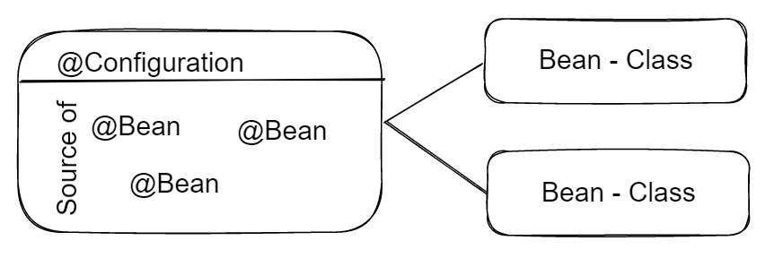

# Spring Framework

Spring es un framework de código abierto que te ayuda a crear aplicaciones en Java o Kotlin de forma más fácil, rápida y ordenada.  
En vez de que tú tengas que hacer todo a mano (crear objetos, conectar clases, preparar la base de datos, configurar servidores…), Spring lo hace por ti automáticamente.  

💭 Imagina que construir una aplicación es como montar un mueble enorme.  

- Sin Spring: tú haces todos los agujeros, ajustes y conexiones.  
- Con Spring: el mueble viene ya pre-montado y solo colocas las piezas que necesitas.  

🪄 Spring te da la estructura y se encarga de la parte difícil.

**Filosofía de Spring**{.azul}

Spring se basa principalmente en dos **ideas fundamentales**:

* 1️⃣**Inversión de Control (IoC) 🔄**: Spring se encarga de crear y gestionar los objetos de tu aplicación.

* 2️⃣**Inyección de Dependencias (DI)🔌**: Spring coloca los objetos donde hacen falta automáticamente.

Es como si Spring fuera quien enchufa los cables para que todas las piezas funcionen juntas sin que tú los conectes.

Además de IoC y DI, Spring se basa en tres **pilares prácticos**:

* 3️⃣**Anotaciones**: indican qué hace cada clase.

    - @Controller → muestra páginas
    - @RestController → devuelve JSON
    - @Service → lógica de negocio
    - @Repository → acceso a datos
    - @Entity → tabla de la base de datos

* 4️⃣**Autoconfiguración (Spring Boot)**: prepara el proyecto por ti.

    - servidor web
    - conexión a BD
    - estructura de proyecto
    - dependencias necesarias

* 5️⃣**Starters**: paquetes listos para usar según lo que quieras hacer..

    - spring-boot-starter-web → para rutas y controladores
    - spring-boot-starter-data-jpa → para BD y CRUD
    - spring-boot-starter-thymeleaf → para páginas HTML

**Componentes principales:**{.azul}

Los componentes principales de Spring Framework son:

* **Spring Core**: El núcleo del framework, encargado de la inyección de dependencias.
* **Spring MVC**: Permite el desarrollo de aplicaciones web utilizando el patrón Modelo-Vista-Controlador.
* **Spring Boot**: Facilita la creación de aplicaciones basadas en Spring con una configuración mínima.
* **Spring Data**: Simplifica el acceso a datos con soporte para JPA, MongoDB, Redis, entre otros.
* **Spring Security**: Proporciona herramientas para implementar seguridad en aplicaciones.
* **Spring Cloud**: Ayuda en la construcción de aplicaciones distribuidas y microservicios.

**Requisitos previos para crear una aplicación con Spring**{.azul}

* JDK: Asegúrate de tener Java Development Kit instalado.
* Maven o Gradle: Para gestionar dependencias.
* IDE: IntelliJ IDEA, Eclipse u otro entorno de desarrollo.

<!--

**Spring Core**

Es el núcleo del framework, encargado de la inyección de dependencias (DI).

**Inyección de Dependencias (DI)**

La Inyección de Dependencias es un patrón fundamental en Spring que permite a las clases declarar las dependencias que necesitan, dejando que el contenedor de Spring las proporcione automáticamente. Esto se logra mediante el uso de anotaciones o configuración explícita.

**Tipos de inyección de dependencias:** Constructor, Setter o Campo.

<u>Inyección por constructor (recomendada):</u>

Se realiza pasando las dependencias necesarias como parámetros al constructor de la clase.

    import org.springframework.stereotype.Service

    @Service
    class MiServicio(private val repositorio: MiRepositorio){
        fun realizarAccion() {
            println("Usando el repositorio: $miRepositorio")
        }
    }

* Spring detecta el constructor y resuelve automáticamente las dependencias necesarias.
  
* En Kotlin, el modificador private en el constructor asegura que la dependencia no se exponga como una propiedad pública.

<u>Inyección por setter:</u>

Se realiza proporcionando métodos setter para establecer las dependencias después de crear el objeto.

    import org.springframework.beans.factory.annotation.Autowired
    import org.springframework.stereotype.Service

    @Service
    class MiServicio {
        private lateinit var miRepositorio: MiRepositorio

        fun setMiRepositorio(miRepositorio: MiRepositorio) {
            this.miRepositorio = miRepositorio
        }

        fun realizarAccion() {
            println("Usando el repositorio: $miRepositorio")
        }
    }

Spring llama al método setMiRepositorio y pasa la dependencia configurada.    

<u>Inyección directa en campos:</u>

Se realiza directamente en las propiedades de la clase, usando anotaciones como @Autowired o inyectándolas mediante el constructor en Kotlin.

    import org.springframework.stereotype.Service

    class MiServicio {
        @Autowired
        private lateinit var miRepositorio: MiRepositorio

        fun realizarAccion() {
            println("Usando el repositorio: $miRepositorio")
        }
    }

Spring inyecta directamente la dependencia en el campo marcado con @Autowired.
   

**Contenedor Spring**

En Spring, los conceptos IoC y DI se implementan a través del
contenedor Spring, que crea y gestiona los objetos de la aplicación,
que se conocen como **beans**.
Los beans y sus dependencias se configuran en archivos de
configuración de Spring o mediante anotaciones en el código.

**Beans**

En el contexto de Spring, un **Bean** es un objeto que es gestionado por el contenedor de Spring.
Estos beans son los componentes esenciales de una aplicación Spring y su ciclo de vida es manejado  por el framework, permitiendo una inyección de dependencias eficiente y una configuración centralizada, y que puede utilizarse para proporcionar servicios o funcionalidades a otras  partes de la aplicación.

Hay varias formas de definir beans en Spring Boot, y la más común es a través de **anotaciones**. 

**Anotaciones**

Las anotaciones son herramientas utilizadas para indicar a Spring cómo manejar un Bean o cómo configurar ciertos aspectos de la aplicación. Por ejemplo, @Bean le dice a Spring que cree y gestione un Bean, mientras que @Component marca una clase para ser detectada automáticamente como Bean.

    @Configuration: Define una clase de configuración.

    @Bean: Declara un Bean manualmente.

Alternativamente, los Beans pueden configurarse mediante un **archivo XML** (menos común hoy en día).

**Ejemplos de configuración con anotaciones:**

**Definir un Bean con @Component**{.verde}

    import org.springframework.stereotype.Component;

    @Component
    public class MiComponente {
        public String saludar() {
            return "Hola desde MiComponente";
        }
    }

**Crear un servicio con @Service**{.verde}

    import org.springframework.stereotype.Service;

    @Service
    public class MiServicio {
        public String obtenerMensaje() {
            return "Mensaje desde MiServicio";
        }
    }

**Configurar un Bean manualmente con @Bean**{.verde}
  

    import org.springframework.context.annotation.Bean;
    import org.springframework.context.annotation.Configuration;

    @Configuration
    public class MiConfiguracion {
        @Bean
        public MiComponente miComponente() {
            return new MiComponente();
        }
    }
---

-->