# Spring Boot

**¿Qué es Spring Boot?**

Spring Boot es una herramienta de desarrollo que se basa en Spring Framework. Se enfoca en simplificar y acelerar el desarrollo de aplicaciones web y microservicios, ofreciendo una configuración automática y la capacidad de crear aplicaciones que se ejecutan de forma independiente sin necesidad de un servidor web externo.

Para entender el concepto, primero debemos reflexionar sobre cómo construimos aplicaciones con Spring

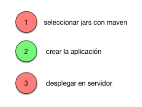

**Fundamentalmente existen tres pasos a realizar**. El primero es crear un proyecto
Maven/Gradle y descargar las dependencias necesarias. En segundo lugar desarrollamos
la aplicación y en tercer lugar la desplegamos en un servidor. Si nos ponemos a pensar
un poco a detalle en el tema, únicamente el paso dos es una tarea de desarrollo. Los
otros pasos están más orientados a infraestructura.

SpringBoot nace con la intención de simplificar los pasos 1 y 3 y que nos podamos
centrar en el desarrollo de nuestra aplicación. ¿Cómo funciona? El enfoque es sencillo y lo entenderemos realizando un ejemplo.

También tendrá especial importancia el archivo **applicantion.properties** que será donde
configuraremos aspectos relativos con nuestra aplicación, tales como las conexiones a base de datos o el puerto por donde acceder a nuestra aplicación por ejemplo. También podemos ver todas las dependencias que se han añadido gracias al archivo **pom.xml**

<!--
**Usos comunes de Spring Boot:**

* APIs RESTful
* Aplicaciones web basadas en MVC
* Microservicios
* Aplicaciones de procesamiento de datos
* Integraciones con bases de datos y mensajería (Kafka, RabbitMQ, etc.) 

Antes de crear una aplicación en SpringBoot, en neceario conocer algunas partes de la aplicación:

* Dependencias de inicio (starters)
* Anotación de inicio de Aplicación (@SpringBootApplication)
* Archivo application.properties

**Dependencias de inicio (starters)**{.azul}

Un **Spring Boot Starter** es un paquete (dependencia) proporcionado por Spring Boot que incluye todas las bibliotecas necesarias para una funcionalidad específica de manera preconfigurada, eliminando la necesidad de configurar cada librería individualmente.

Un starter es esencialmente una dependencia Maven (o Gradle) con un identificador **spring-boot-starter-`<`funcionalidad`>`**. Cada starter agrupa varias bibliotecas relacionadas.

Por ejemplo: **spring-boot-starter-web** incluye todo lo necesario para desarrollar aplicaciones web, como el servidor embebido Tomcat, Spring MVC, y otras dependencias esenciales.

       pom.xml
        <dependencia> 
            <groupId> org.springframework.boot </groupId> 
            <artefacto> spring-boot-starter-web </artefacto> 
        </dependencia>

<u>Propiedades:</u>

* Incorporación fácil: Solo necesitas incluir el starter correspondiente en el archivo de configuración de dependencias.
* Configuración automática: Los starters están diseñados para aprovechar el principio de convención sobre configuración. Esto significa que la configuración predeterminada ya está lista para funcionar, y tú solo necesitas personalizarla si es necesario. 
* Reducción de complejidad: Evitas buscar manualmente qué librerías necesitas o resolver conflictos entre dependencias.
* Spring Boot configura automáticamente tu aplicación en función de las dependencias que haya agregado al proyecto mediante **anotaciones**.

Algunos de esos **starters** son:

* **spring-boot-starter-parent**: define los valores predeterminados comunes, como la versión de Java, la codificación de fuente, o varias configuraciones de complementos de Maven.
* **spring-boot-starter-web**: específica un grupo de dependencias para
desarrollar aplicaciones web como Spring web MVC y el servidor Tomcat.
* **spring-boot-maven-plugin**: permite la creación automática de un archivo
JAR ejecutable para una aplicación web Java independiente con un
servidor Tomcat incorporado.
* **spring-boot-starter-data-jpa**: incluye todas las dependencias
necesarias para usar Spring Data JPA, junto con las dependencias de la
biblioteca Hibernate, la implementación de JPA más utilizada.
* **spring-boot-starter-thymeleaf**: Para trabajar con plantillas HTML usando Thymeleaf.
* **spring-boot-starter-security**: Proporciona autenticación y autorización con Spring Security.

Estos **starters** se han de inluir manualmente en el archivo pom.xml, si utilizas Maven, o seleccionarlos en la pestaña de dependencias del asistente del IDE, al crear el proyecto SpringBoot.

| pom.xml      | IntelliJ     |
|--------------|--------------|
| 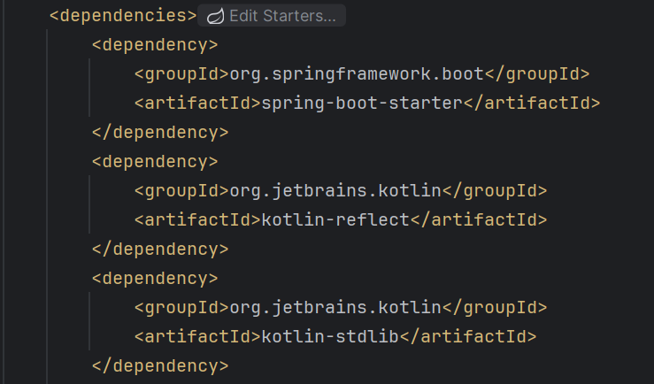 | 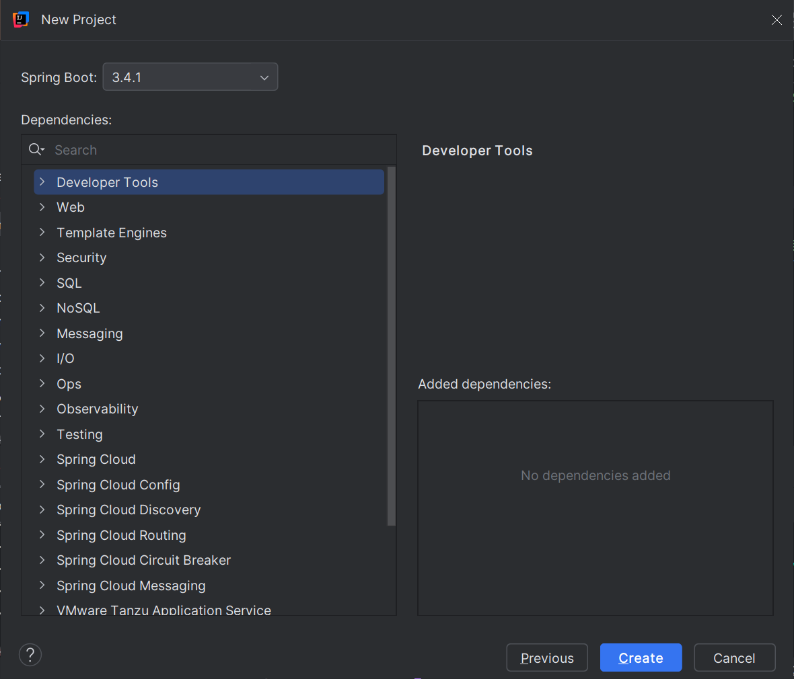 |

**Anotación de inicio de Aplicación (@SpringBootApplication)**{.azul}

Cuando creas una aplicación Spring Boot, el proyecto generado incluye, por defecto, la anotación más básica y fundamental de Spring Boot, que es: **@SpringBootApplication**

Esta anotación se agrega automáticamente a la clase principal de la aplicación. 

    @SpringBootApplication
    class MyApplication 
    fun main(args: Array<String>) {
        runApplication<MyApplicationion>(*args)
    }

!!!note "Nota"
    Al igual que cualquier otro programa Java, una aplicación Spring Boot debe tener un método principal. Este método sirve como punto de entrada, que invoca el método **runApplication** para iniciar la aplicación.

**@SpringBootApplication** es una combinación de tres anotaciones clave:

>>1) **@Configuration**  
>>Indica que la clase puede contener definiciones de beans que se registrarán en el contenedor de Spring.

>>2) **@EnableAutoConfiguration**  
>>Habilita la configuración automática basada en las dependencias que encuentres en el classpath.

>>3) **@ComponentScan**  
>>Escanea automáticamente los paquetes del proyecto para detectar componentes, servicios, y configuraciones (@Component, @Service, @Repository, @Controller, etc.).

!!!note "Nota"
    Aunque no hayas añadido dependencias, **@EnableAutoConfiguration** intentará configurar un entorno básico. Sin dependencias, esta configuración será mínima.
    **@ComponentScan** buscará automáticamente cualquier clase anotada con **@Component**, **@Service**, o similares, dentro del paquete raíz y sus subpaquetes.

**Archivo application.properties**{.azul}

Este archivo se utiliza para externalizar propiedades de configuración, lo que le permite definir configuraciones, como puertos de servidor, conexiones de base de datos y propiedades específicas de la aplicación. Se coloca en la carpeta **src/main/resources** del proyecto Spring Boot. 

<u>Ejemplos:</u>

**Configuración del servidor:**{.verde}

    # Puerto del servidor
    server.port=8080

    # Contexto de la aplicación (URL base)
    server.servlet.context-path=/miapp

**Configuración de la base de datos**{.verde}

    # Configuración de la base de datos
    spring.datasource.url=jdbc:mysql://localhost:3306/mi_base_de_datos
    spring.datasource.username=usuario
    spring.datasource.password=contraseña

    # Tipo de conexión (opcional, detectado automáticamente)
    spring.datasource.driver-class-name=com.mysql.cj.jdbc.Driver

**Configuración de correo electrónico**{.verde}

    # Configuración del servidor SMTP
    spring.mail.host=smtp.gmail.com
    spring.mail.port=587
    spring.mail.username=tu_correo@gmail.com
    spring.mail.password=tu_contraseña
    spring.mail.properties.mail.smtp.auth=true
    spring.mail.properties.mail.smtp.starttls.enable=true

**Configuración personalizada**{.verde}

    # Propiedades definidas por el usuario
    miapp.nombre=Mi Aplicación
    miapp.version=1.0.0
    
-->

## Primera aplicación SpringBoot

Para entender la filosfía de Spring lo mejor es hacer una primera aplicación sencilla. Esta aplicación consistirá en devolver un saludo al usuario a través de un navegador web. Acontinuación se detallan los pasos a seguir.

Podemos crear los proyectos Spring Boot de dos maneras:

* Mediante una herramienta web online (<https://start.spring.io/>) denominada **Spring Initializr**, donde por medio de unos parámetros de configuración, genera automáticamente un proyecto Maven o Gradle, según elijamos, en un archivo comprimido Zip, con la estructura de la aplicación y que puede ser importada directamente desde un IDE. 

* Mediante un IDE, como Eclipse, IntelliJ...etc, teniendo instalados los plugins necesarios. 
  
En nuestro caso crearemos un proyecto **Maven** de Spring Boot en **IntelliJ**:

**Crear la aplicación y añadir dependencias**{.azul}

  1) Creamos el proyecto y lo configuramos desde **File-->New-->Project**:
   
* Elige **Spring Boot**.
* Configura las siguientes opciones:
  
    * Language: **Kotlin**
    * Build System: **Maven**
  
  * Especifica un nombre para el proyecto: **PrimerSpringBoot**
  * Última versión de **JDK**
  * Última versión de **Java**

  2) Posteriormente seleccionamos las dependencias necesarias:
   
>>**Spring Web** (para el desarrollo de aplicaciones web)
  
  3) Después de aceptar, y si todo ha ido correctamente, ya tendremos nuestro proyecto creado.

|   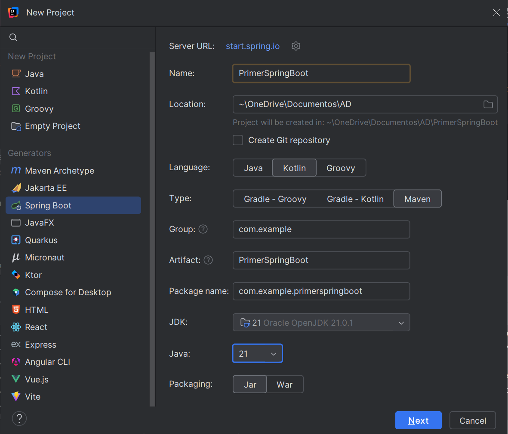  |   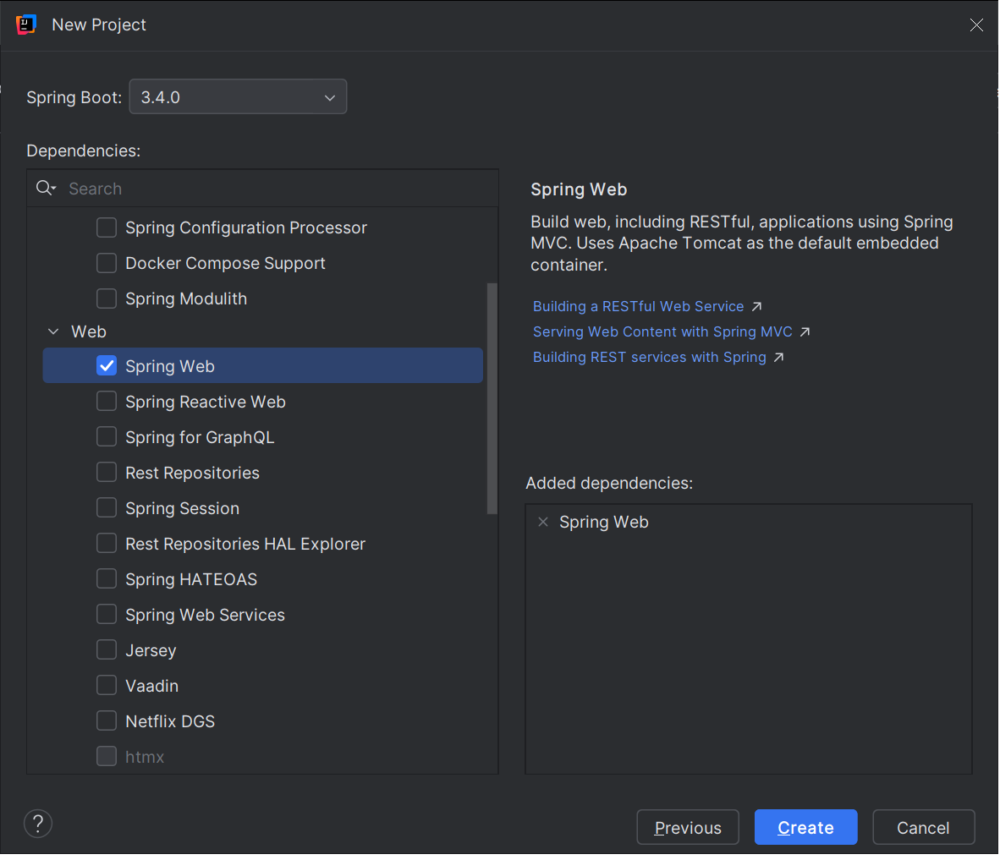    |
|---|---|

!!!note "Nota"
    Para este proyecto solo necesitaremos la dependenica **Spring Web**:

     * Se utiliza para desarrollar aplicaciones web, ya sea basadas en REST o tradicionales con HTML dinámico.   
     * Incluye un servidor web embebido (por defecto, Tomcat) para ejecutar la aplicación sin necesidad de configurarlo manualmente.   
     * Facilita el manejo de rutas HTTP (GET, POST, PUT, DELETE, etc.) y parámetros de solicitud a través de métodos en los controladores.  
     * Usa la biblioteca Jackson (incluida por defecto) para convertir automáticamente objetos Kotlin/Java a JSON y viceversa.  
     * Ofrece herramientas para manejar errores y excepciones de forma global mediante @ControllerAdvice o controladores personalizados.  

Al iniciar nuestra aplicación, lo primero que observamos es que se crea
una clase **PrimerSpringBootApplication**  que sirve como contenedor para la configuración de la aplicación. No necesitas implementar métodos adicionales, ya que Spring Boot se encarga de todo gracias a la anotación **@SpringBootApplication**.  

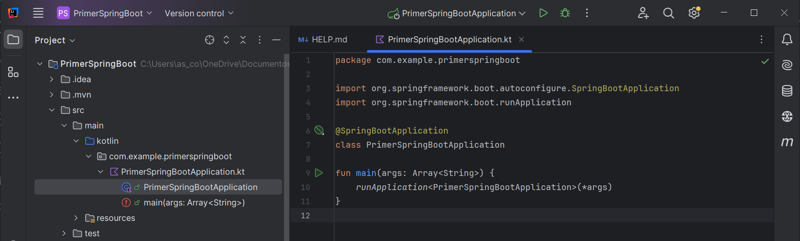

La clase está anotada con **@SpringBootApplication** y, **runApplication**, es una función de extensión proporcionada por Spring Boot para lanzar la aplicación.

    @SpringBootApplication
    class PrimerSpringBootApplication

    fun main(args: Array<String>) {
        runApplication<PrimerSpringBootApplication>(*args)
    }

* El tipo genérico `<`**PrimerSpringBootApplication**`>` indica que ésta es la clase principal de la aplicación que contiene la anotación **@SpringBootApplication**.

* ***args** pasa los argumentos de la línea de comandos a la aplicación. Se utiliza para descomponer un array (como Array`<`String`>`) en argumentos individuales, lo que es necesario para pasar los parámetros de la línea de comandos al método runApplication.   

**Agregar un método que envíe un saludo**{.azul}

Agregaremos el método **sayHello()** directamente a la clase principal, **PrimerSpringBootApplication**, con todas las anotaciones e importaciones necesarias::

    package com.example.primerspringboot

    import org.springframework.boot.autoconfigure.SpringBootApplication
    import org.springframework.boot.runApplication
    import org.springframework.web.bind.annotation.GetMapping
    import org.springframework.web.bind.annotation.RequestParam
    import org.springframework.web.bind.annotation.RestController

    @SpringBootApplication
    @RestController
    class PrimerSpringBootApplication{

        @GetMapping("/hello")
        fun sayHello(
            @RequestParam(value = "myName", defaultValue = "World") name: String): String 
            {
                return "Hello $name!"
            }
        }

    fun main(args: Array<String>) {
        runApplication<PrimerSpringBootApplication>(*args)
    }

* **@RestController**: se utiliza para que Spring reconozca la clase como un controlador que maneja solicitudes HTTP. Combina:
    * @Controller: Define la clase como un controlador web.
    * @ResponseBody: Indica que los métodos devolverán directamente el cuerpo de la respuesta (en este caso, texto plano en lugar de una vista HTML).

* **@GetMapping("/hello")**: Es una anotación de Spring que indica que este método debe manejar las solicitudes HTTP GET que lleguen a la URL /hello.

    * Enlaza la URL /hello con el método sayHello.
      
    * Cada vez que se acceda a esa ruta en un navegador con un método GET, Spring ejecutará el método sayHello. Por ejemplo, al visitar <http://localhost:8080/hello> (asumiendo el puerto predeterminado 8080), este método será invocado.

* **@RequestParam**: se usa para extraer un parámetro de la consulta (query parameter) enviado en la URL.

    * El método espera un parámetro de consulta llamado myName.
      
    * Si el cliente no incluye myName en la solicitud, el valor predeterminado será "World", gracias a defaultValue = "World".
  
---

**Ejecuta la aplicación Spring**{.azul}

* Al ejecutar la aplicación, la pestaña **Consola** muestra la salida de los mensajes de registro de Spring.

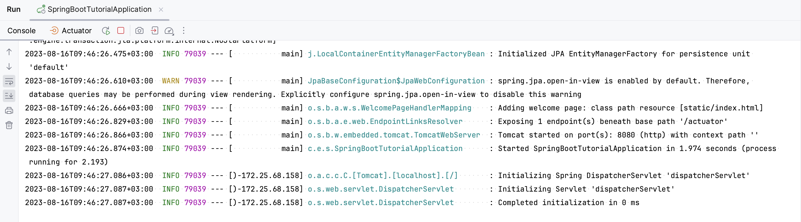

De manera predeterminada, el servidor Apache **Tomcat** integrado escucha en el puerto **8080**.

!!!note "Nota"
    Si tienes el puerto 8080 ocupado, te aparecerá el siguiete error:
    
    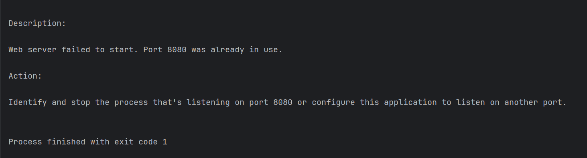
    
    Puedes cambiar el puerto en el archivo **application.properties** que se encuentra en la carpeta **resources** de tu proyecto.

    Por ejemplo estaleciendo el puerto a 8888:
    
    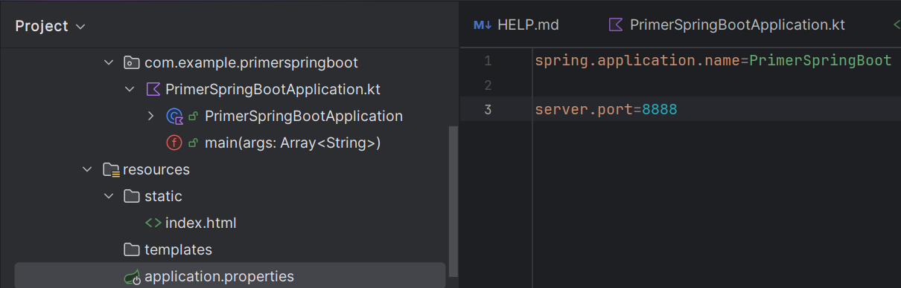

* Ahora abre el navegador web a la dirección [http://localhost:8080/hello](http://localhost:8080/hello), o con el puerto que hayas seleccionado. Deberías ver que tu aplicación responde con **Hello World!**.

!!!note "Nota"
    Esta es la respuesta genérica predeterminada. 
    Puedes proporcionar un parámetro en tu solicitud web para que la aplicación sepa cómo saludarte correctamente. 
    
    Por ejemplo, prueba [http://localhost:8080/hello?myName=Alicia](http://localhost:8080/hello?myName=Alicia).

Para entender el funcionamiento de la aplicación, aquí tienes resumido su flujo de ejecución:    

!!!tip "Flujo de ejecución"
    
     **Inicio de la aplicación:**  
    Se ejecuta el método main, lo que inicia un servidor web embebido (por defecto, **Tomcat**) en el puerto **8080**.

    **Solicitudes HTTP:**  
    Cuando un cliente envía una **solicitud GET a /hello** con o sin el parámetro **myName**, **el método sayHello** maneja la solicitud.

    **Respuesta:**  
    La aplicación devuelve un mensaje personalizado en texto plano según el parámetro **myName**.

 

**Añadir una página de inicio**{.azul}

La aplicación Spring Boot creada tiene un punto final disponible en /hello. Sin embargo, si abres el contexto raíz de tu aplicación en [http://localhost:8080/](http://localhost:8080/), obtendrás un error porque no hay ningún recurso raíz definido. 
Añade una página de inicio HTML estática con enlaces a su punto final.

* **Crea** el archivo **index.html** en **/src /main /resources /static/** .

Modifica la plantilla predeterminada o reemplázala con el siguiente código HTML:

    <!DOCTYPE HTML>
    <html>
        <head>
            <title>Your first Spring application</title>
            <meta http-equiv="Content-Type" content="text/html; charset=UTF-8" />
        </head>
        <body>
            
<a href="/hello">Greet the world!</a>

            <form action="/hello" method="GET" id="nameForm">
                

                    <label for="nameField">How should the app call you?</label>
                    <input name="myName" id="nameField">
                    <button>Greet me!</button>
                

            </form>
        </body>
    </html>

* **Ejecuta** la aplicación de nuevo.

Ahora tu aplicación servirá index.html como recurso raíz en 
[http://localhost:8080/](http://localhost:8080/) . 

| 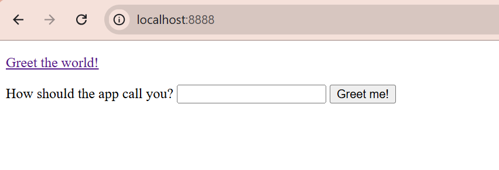|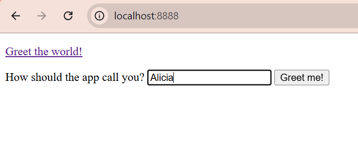|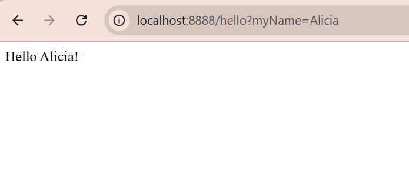|
|---|---|---|

