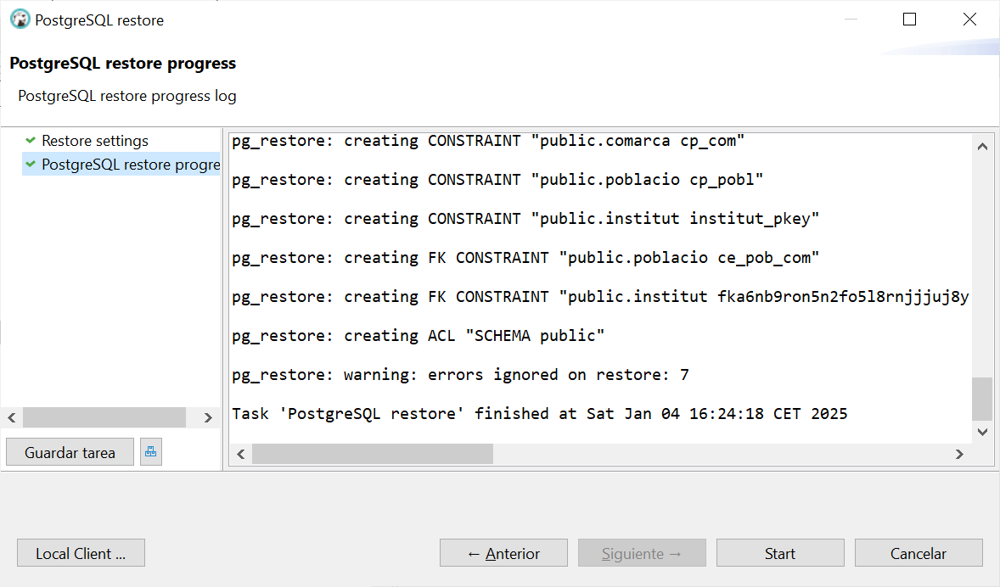

# 🔹Spring Data


Spring Data es un proyecto dentro del ecosistema **Spring** que proporciona  herramientas y abstracciones para facilitar el acceso a bases de datos y otras  
fuentes de datos de manera **eficiente y consistente**.  

Su objetivo principal es **simplificar la interacción con diferentes tipos de  bases de datos**, tanto **relacionales** (como PostgreSQL o MySQL) como  
**NoSQL** (por ejemplo MongoDB o Cassandra), reduciendo la cantidad  de código necesario y **unificando la forma de trabajar con los datos**.


|


**¿Para qué se utiliza?**{.azul}

1️⃣ **Acceso Simplificado a Datos:** 
 
* Reduce la necesidad de escribir consultas SQL complejas o código JDBC al exponer métodos predefinidos para operaciones comunes.
* Permite realizar operaciones CRUD (Crear, Leer, Actualizar, Eliminar) con facilidad.
  
2️⃣ **Abstracción de Repositorios:**

Ofrece la interfaz **Repository** y subinterfaces como **CrudRepository** y **JpaRepository** que proporcionan métodos estándar para la gestión de entidades en bases de datos relacionales.

3️⃣ **Consultas Personalizadas:**

Permite escribir consultas personalizadas mediante anotaciones como **@Query**.
También admite la creación de métodos de consulta basados en el nombre del método, como **findByNombre(String nombre)**.

4️⃣ **Compatibilidad con Múltiples Tecnologías de Bases de Datos:**

 * Relacionales: Mediante JPA (Java Persistence API).
 * NoSQL: MongoDB, Redis, Neo4j, Cassandra, etc.
 * Buscadores: Elasticsearch, Solr.

5️⃣ **Configuración Declarativa:**

Al integrar Spring Data con Spring Boot, se pueden configurar muchas opciones mediante propiedades en **application.properties**, evitando configuraciones manuales detalladas.

6️⃣ **Integración con Spring Boot:**

Con dependencias específicas como **spring-boot-starter-data-jpa** o **spring-boot-starter-data-mongodb**, Spring Data se integra perfectamente con el resto del ecosistema de Spring.

**Principales Módulos de Spring Data**{.azul} 

- **Spring Data JPA:**: Proporciona una integración con JPA para bases de datos relacionales.
Es ideal para trabajar con entidades Java mapeadas a tablas de bases de datos.
JPA es la especificación para persistir, leer y gestionar data desde los objetos Java a la base de datos.
- **Spring Data MongoDB:**: Facilita el acceso a bases de datos MongoDB, una base de datos NoSQL orientada a documentos.
- **Spring Data Redis:**: Para aplicaciones que necesitan interactuar con Redis, una base de datos en memoria.
- **Spring Data Cassandra:**: Proporciona soporte para bases de datos distribuidas como Cassandra.
- **Spring Data Elasticsearch:**: Simplifica las interacciones con Elasticsearch, un motor de búsqueda y análisis.


## 🔹Spring Data JPA

<!---->

Spring Data JPA es parte de Spring Framework. Es un módulo de Spring Data que sirve para simplificar el acceso a bases de datos relacionales usando **JPA** (Java Persistence API). Permite trabajar con bases de datos usando objetos (clases) sin tener que escribir SQL ni código repetitivo.

Con Spring Data JPA:

- Solo defines entidades (@Entity)
- Creas interfaces Repository
- Spring genera automáticamente el código

### Anotaciones Comunes

#### 1. Mapeo de Entidades (JPA Estándar)
Estas anotaciones son parte de JPA y permiten mapear clases y relaciones a tablas en la base de datos.

- **@Entity** - Marca una clase como una entidad JPA, mapeada a una tabla en la base de datos.
  
        @Entity
        data class User(
            @Id
            val id: Long,
            val name: String
        )
 

- **@Table** - Especifica el nombre de la tabla que corresponde a la entidad.

        @Entity
        @Table(name = "users")
        data class User(
            @Id
            val id: Long,
            val name: String
        )
  

- **@Id** - Indica que un campo es la clave primaria de la tabla.

        @Id
        val id: Long
  

- **@GeneratedValue** - Define cómo se genera el valor de la clave primaria.
  
  >Estrategias comunes: `GenerationType.IDENTITY`, `GenerationType.SEQUENCE`, etc.

        @Id
        @GeneratedValue(strategy = GenerationType.IDENTITY)
        val id: Long
 

- **@Column** - Configura una columna de la tabla, como nombre, si es nula o única.

            @Column(name = "user_name", nullable = false, unique = true)
            val name: String
 


- **@ManyToOne**, **@OneToMany**, **@OneToOne**, **@ManyToMany**
  
  >Define relaciones entre entidades.
      
            @ManyToOne
            val department: Department
    

- **@JoinColumn** - Especifica la columna que actúa como clave foránea.
 
            @ManyToOne
            @JoinColumn(name = "department_id")
            val department: Department
    


- **@Lob** - Indica que un campo es un objeto grande (texto o binario).
   
            @Lob
            val description: String
    

- **@Transient**  - Excluye un campo del mapeo de base de datos (no se almacena).
  
            @Transient
            val calculatedField: String
    

---

#### **2. Específicas de Spring Data JPA**

Estas anotaciones son propias de Spring Data JPA y extienden la funcionalidad de JPA.

- **@Repository** - Marca una interfaz o clase como repositorio Spring.

El data class representa la entidad (tabla), mientras que el @Repository se encarga de las operaciones de acceso a datos sobre esa entidad.
  
        @Repository
        interface UserRepository : JpaRepository<User, Long>


- **@Query** - Define una consulta personalizada usando JPQL o SQL nativo.

>>- Ejemplo (JPQL):
  
        @Query("SELECT u FROM User u WHERE u.name = :name")
        fun findByName(@Param("name") name: String): List<User>
  
>>- Ejemplo (SQL nativo):
  
        @Query(value = "SELECT * FROM users WHERE user_name = :name", nativeQuery = true)
        fun findByNameNative(@Param("name") name: String): List<User>
  

**@Param** - Define parámetros nombrados para consultas con `@Query`.

        @Query("SELECT u FROM User u WHERE u.name = :name")
        fun findByName(@Param("name") name: String): List<User>
  

**@Modifying** - Se utiliza con consultas `@Query` para operaciones de actualización o eliminación.

        @Modifying
        @Query("UPDATE User u SET u.name = :name WHERE u.id = :id")
        fun updateName(@Param("id") id: Long, @Param("name") name: String)
  

**@EnableJpaRepositories** - Habilita la funcionalidad de Spring Data JPA y escanea paquetes para detectar repositorios.

        @EnableJpaRepositories(basePackages = ["com.example.repository"])
  

**@EntityGraph** - Especifica cómo cargar las relaciones en una consulta, evitando lazy loading.

        @EntityGraph(attributePaths = ["roles"])
        fun findByName(name: String): User
  

---

#### **3. Transacciones**

- **@Transactional** - Marca un método o clase para ejecutar dentro de una transacción.

        @Transactional
        fun updateUserDetails(user: User) { ... }
  

- **@Rollback** - Utilizada en pruebas para forzar la reversión de una transacción.
  
        @Transactional
        @Rollback
        fun testSaveUser() { ... }

### Consultas a la Base de Datos

Las consultas a la Base de datos las podemos hacer de dos maneras, utilizando la **convención de nombres** en funciones de Spring Data JPA o con la anotación **@Query**.
 
✔️ La **convención de nombres** se utiliza:

* En consultas sencillas y que no requieren lógica compleja ni múltiples combinaciones.
* Cuando quieres mantener un código más limpio y directo.

✔️ La anotación **@Query** se utiliza:

* En consultas complejas que involucren múltiples tablas, condiciones avanzadas o subconsultas.
* Si prefieres optimizar manualmente las consultas.
* Cuando la convención de nombres generaría un nombre de método excesivamente largo.


#### **Convención de Nombres**{.azul}

Spring Data JPA permite definir métodos en repositorios siguiendo una convención de nombres específica. Esto simplifica la escritura de consultas comunes sin necesidad de usar JPQL o SQL. Para ello analiza el nombre de los métodos en el repositorio e interpreta su significado para generar consultas automáticamente. 

La estructura básica es:

        findBy + NombreDeCampo + Condición

1) **findBy**:

Indica que se busca una entidad en la base de datos.
Alternativas:
    
* readBy (lectura de datos)
* queryBy (consulta de datos)
* getBy (obtener datos)

2) **NombreDeCampo**:

* Debe coincidir exactamente con el nombre del atributo en la entidad.
* Se puede incluir navegación de atributos para relaciones (EntidadRelacionada.Atributo).

3) **Condición** (opcional):

* Permite añadir operadores lógicos como And, Or, etc.
* Ejemplo: findByNombreAndEdad.    


**Ejemplos de métodos según la convención**{.azul}

* Consultas simples
    
    * Método: findByNombre(String nombre)
    * Consulta generada: 
            
            SELECT * FROM entidad WHERE nombre = ?

* Consultas con condiciones
    
    * Método: findByNombreAndEdad(String nombre, Integer edad)
    * Consulta generada: 
            
            SELECT * FROM entidad WHERE nombre = ? AND edad = ?

* Consultas con orden
    
    * Método: findByNombreOrderByEdadDesc(String nombre)
    * Consulta generada: 
  
            SELECT * FROM entidad WHERE nombre = ? ORDER BY edad DESC

* Consultas con relaciones. Si hay una relación entre entidades, se puede navegar por los campos relacionados:

    * Método: findByComarcaNomC(String nomC)
    * Consulta generada: 
     
             SELECT * FROM entidad e JOIN comarca c ON e.comarca_id = c.id WHERE c.nomC = ?

**Palabras clave en la convención**


!!!warning "Consideraciones"
    * **Coincidencia exacta del nombre del campo**: Los nombres deben coincidir con los atributos definidos en la entidad.
    * **Relaciones**: Usa la notación EntidadRelacionada.Atributo para navegar entre tablas relacionadas.
    * **Orden**: Los métodos pueden incluir palabras clave de ordenación, como OrderBy.
    * **Parámetros**: Los métodos generados reciben parámetros en el mismo orden en que se declaran en el nombre del método.  


#### **@Query**{.azul}

<u>Estructura básica:</u>

    @Query("SELECT e FROM EntityName e WHERE e.property = :value")
    fun findByProperty(@Param("value") value: String): List<EntityName>
 
* Se utilizan nombres de entidades y propiedades de las clases en lugar de nombres de tablas y columnas.
* Se puede navegar por relaciones entre entidades.
* _:nombreParametro_ para parámetros dinámicos.

<u>Ejemplo sencillo:</u>

    @Query("SELECT c FROM Comarca c WHERE c.provincia = :provincia")
    fun findByProvincia(@Param("provincia") provincia: String): List<Comarca>

<u>Ejemplo con relaciones:</u> 

Siguiendo con nuestro ejemplo de geo_ad, la consulta para buscar Institutos en una Provincia por Población Mínima quedaría así:


    @Query("""
        SELECT i FROM Institut i
        JOIN i.poblacio p
        JOIN p.comarca c
        WHERE c.provincia = :provincia AND p.poblacion >= :minPoblacion
    """)
    fun findByProvinciaAndPoblacion(
        @Param("provincia") provincia: String,
        @Param("minPoblacion") minPoblacion: Int
    ): List<Institut>


**Este mismo ejemplo utilizando convención de nombres quedaría así:**{.verde}

    @Repository
    interface InstitutRepository : JpaRepository<Institut, String> {
        fun findByPoblacioComarcaProvinciaAndPoblacioPoblacionGreaterThanEqual(
            provincia: String,
            minPoblacion: Int
        ): List<Institut>
    }


* **findBy**: Indica que es un método de consulta.
* **PoblacioComarcaProvincia**: Navega por las relaciones de las entidades Institut  Poblacio -> Comarca para filtrar por la provincia.
* **AndPoblacioPoblacionGreaterThanEqual**: Navega por Institut -> Poblacio y aplica el filtro de población mínima.    

!!!note ""
    A medida que las relaciones aumentan en complejidad, los nombres de los métodos pueden volverse difíciles de leer y mantener.


### Base de Datos Postgres.

En este ejemplo vamos a crear una aplicación sencilla que acceda a una base de datos Postgres. Para ello utilizaremos la base de datos **geo_ad**, que ya conocemos de temas anteriores, y que se encuentra en el servidor externo **89.36.214.106**.
La aplicación simplemente mostrará la información de la tabla **comarcas**.

Para esta aplicación crearemos un nuevo proyecto, con la misma configuración que el anterior, pero añadiremos las dependencias necesarias de acceso a la Base de Datos. 

**Configurar el proyecto**{.azul}
   
1) Creamos el proyecto y lo configuramos desde **File-->New-->Project**:
   
* Elige **Spring Boot**.
* Configura las siguientes opciones:
  
    * Language: **Kotlin**
    * Build System: **Maven**

* Especifica un nombre para el proyecto: **PrimerSpringMVC**
* Última versión de **JDK**
* Última versión de **Java**


2) Posteriormente seleccionamos las dependencias necesarias:
  
!!!note nota
    Como la aplicación accede a una Base de datos, necesitaremos las dependencias adicionales **Spring Data JPA** y **PostgreSQL Driver**.
    
    * **Spring Web** (para el desarrollo de aplicaciones web)
    * **Thymeleaf** (motor de plantillas para la vista)
    * **Spring Boot DevTools** (opcional, para facilitar el desarrollo)
    * **Spring Data JPA** (facilita la integración de aplicaciones Spring con bases de datos relacionales utilizando el marco JPA (Java Persistence API))
    * **PostgresSQL Driver** (proporciona el controlador JDBC para conectarse a bases de datos PostgreSQL.)

Después de aceptar, y si todo ha ido correctamente, ya tendremos nuestro proyecto creado y preparado para añadir los elementos de programación.

|     |       |
|---|---|

Al iniciar nuestra aplicación, lo primero que observamos es que se crea
una clase **PrimerSpringMVCApplication**  que sirve como contenedor para la configuración de la aplicación. No necesita implementar métodos adicionales, ya que Spring Boot se encarga de todo gracias a la anotación **@SpringBootApplication**.


**Crear la estructura del Proyecto**{.azul}

La estructura básica del proyecto debe reflejar el patrón MVC. Organiza las carpetas de la siguiente forma:
   
   * **Controladores**: src/main/kotlin/org/tuapp/controller
   * **Vistas**: src/main/resources/templates
   * **Recursos estáticos**: src/main/resources/static
   * **Datos**: src/main/kotlin/org/tuapp/model
   * **Repositorio**: src/main/kotlin/org/tuapp/repository

Para ello crea los paquetes: **controller**, **model** y **repository** dentro de la carpeta **src/main/kotlin/org/tuapp**.


**Implementación de la aplicación**{.azul}

Ahora ya podemos añadir la programación necesaria para nuestra aplicación siguiendo la estructura MVC creada. Dentro de cada paquete crearemos los siguientes archivos:

* **Entidad JPA**

Define las entidades que corresponden a las tablas existentes en la base de datos. No necesitas configuraciones especiales más allá de mapear las columnas.
En nuestro caso definimos la entidad comarca y sus campos.

En el paquete **model** crea un archivo llamado **comarca.kt**

    import jakarta.persistence.*

    @Entity /*Define una clase como una entidad JPA, lo que significa que estará mapeada a una tabla en la base de datos.*/
    @Table(name = "comarca")
    data class comarca(
        @Id /*dentifica el campo como la clave primaria de la entidad.*/
        val nom_c: String = "",
        val provincia: String = ""
    )

    
* **Repositorio**

Crea un repositorio que permita ejecutar consultas sobre la tabla correspondiente.

Dentro del paquete **repository**, crea un archivo llamado **ComarcaRepository.kt**

    import org.example.primerspringmvc.model.comarca
    import org.springframework.data.jpa.repository.JpaRepository
    import org.springframework.stereotype.Repository

    @Repository
    interface ComarcaRepository : JpaRepository<comarca, String> {
    fun findByProvincia(provincia: String): List<comarca>
    } 

* **Controlador**

El controlador manejará las solicitudes GET para obtener información de la base de datos.

Dentro del paquete **controller**, crea un archivo llamado **ComarcaController.kt**

    import org.example.primerspringmvc.model.comarca
    import org.example.primerspringmvc.repository.ComarcaRepository
    import org.springframework.web.bind.annotation.*

    @RestController
    @RequestMapping("/comarcas")
    class ComarcaController(private val comarcaRepository: ComarcaRepository) {

        // Endpoint para obtener todas las comarcas
        @GetMapping
        fun obtenerComarcas(): List<comarca> = comarcaRepository.findAll()
    }    
!!!note ""
    * **@RestController:** Combina **@Controller** y **@ResponseBody**.
    Devuelve directamente datos en formato JSON en lugar de buscar vistas como Thymeleaf.

    * **ObtenerComarcas()**: Devuelve una lista de objetos comarca.
    Spring automáticamente convierte esta lista a JSON usando Jackson (que viene incluido con Spring Boot).


* **Vistas**

Las vistas pueden ser representadas por tecnologías como JSP, Thymeleaf, o JSON (en caso de APIs).

En este ejemplo vamos a visualizar los datos en un navegador con formato **JSON** y más adelante lo haremos mediante **Thymeleaf** para ver ambos casos. 

**Configurar la conexión al Servidor Postgres:**{.azul}

 En el archivo **src/main/resources/application.properties**  configura la conexión a tu base de datos existente:

    spring.datasource.url=jdbc:postgresql://<HOST>:<PUERTO>/<DB_NAME>
    spring.datasource.username=<USUARIO>
    spring.datasource.password=<CONTRASEÑA>
    spring.jpa.hibernate.ddl-auto=update

Cambiaremos los datos de conexión al servidor externo:


!!!warning ""
    Recuerda que puedes cambiar el puerto si lo tienes ocupado. Puedes probar con el puerto 8888.

**Ejecutar la aplicación**{.azul}

La aplicación estará disponible en http://localhost:8080, o el puerto que hayas especificado, para listar las comarcas.
  


!!!warning "" 
    Sería deseable que el resultado se mostrara de manera más amigable para el usuario, por lo que en el siguiente ejemplo haremos los cambios necesarios para utilizar **Thymeleaf** y que el resultado se muestre en cajas de texto.
   

**Thymeleaf para mostrar los resultados:**{.verde}

1) **Configuración de dependencias**. Asegúrate de tener la dependencia de Thymeleaf en tu archivo pom.xml. Esta dependencia la hemos seleccionado al configurar la aplicación y seguramente ya la tengamos incluida.

    <dependency>
        <groupId>org.springframework.boot</groupId>
        <artifactId>spring-boot-starter-thymeleaf</artifactId>
    </dependency>


2) Configurar Thymeleaf en **application.properties**

Añade las siguientes propiedades:
   
    spring.thymeleaf.prefix=classpath:/templates/
    spring.thymeleaf.suffix=.html
    spring.thymeleaf.cache=false  

3) **Modificar el Controlador con datos del repositorio**. El controlador debe recuperar los datos desde el repositorio y pasarlos a la vista usando un modelo. Cambia la implementación del controlador:

    import org.springframework.stereotype.Controller
    import org.example.primerspringmvc.repository.ComarcaRepository
    import org.springframework.ui.Model
    import org.springframework.web.bind.annotation.*

    @Controller
    @RequestMapping("/comarcas")
    class ComarcaController(private val ComarcaRepository: ComarcaRepository) {
        @GetMapping
        fun listarComarcas(model:Model): String {
            val comarcas = ComarcaRepository.findAll()
            model.addAttribute("comarcas", comarcas)
            return "comarcas" // Nombre de la plantilla HTML
        }
    }
      

4) **Vistas**
   
Para agregar un entorno de usuario amigable con cajas de texto y que los datos de la base de datos se muestren en una aplicación web, crea un archivo **comarcas.html** en el directorio **src/main/resources/templates**. 

<!DOCTYPE html>
    <html xmlns:th="http://www.thymeleaf.org">
    <head>
        <title>Lista de Comarcas</title>
    </head>
    <body>
    <h1>Lista de Comarcas</h1>
    <table border="1">
        <tr>
            <th>ID</th>
            <th>Provincia</th>
            
        </tr>
        <tr th:each="comarca : ${comarcas}">
            <td th:text="${comarca.nom_c}">ID</td>
            <td th:text="${comarca.provincia}">Provincia</td>
        </tr>
    </table>
    </body>
    </html>
   
!!!note ""
      * **th:each**: Itera sobre la lista de comarcas.
      * **th:text**: Inserta dinámicamente el valor de un campo en el HTML.     


**Ejecuatar la aplicación**{.azul}

* Accede a http://localhost:8888/comarcas  para listar las comarcas.
 

En el navegador, se mostrará una tabla HTML con las comrcas almacenadas en la base de datos. Los datos dinámicos se renderizan usando **Thymeleaf**. Este enfoque permite crear interfaces web amigables y bien estructuradas.
 


**Ejemplo de consulta a la Base de datos**{.verde}

Con la anotación **@Query** en el repositorio, podemos realizar consultas personalizadas a la base de datos. 
        
A continuación veremos los cambios que deberíamos hacer en los ficheros para poder hacer una consulta con parámetros y visualizar los datos tanto en json com con thymeleaf:

!!!tip "Cambios en los ficheros .kt:"
    **ComarcaRepository**

        import org.springframework.data.jpa.repository.Query
        import org.springframework.data.repository.query.Param
        import org.example.primerspringmvc.model.comarca
        import org.springframework.data.jpa.repository.JpaRepository
        import org.springframework.stereotype.Repository

        @Repository
        interface ComarcaRepository : JpaRepository<comarca, Long> {
            @Query("SELECT c FROM comarca c WHERE c.provincia = :provincia")
            fun findComarcasporProvincia(@Param("provincia") provincia: String): List<comarca>
        }

    **ComarcaController**

        import org.example.primerspringmvc.model.comarca
        import org.springframework.stereotype.Controller
        import org.example.primerspringmvc.repository.ComarcaRepository
        import org.springframework.ui.Model
        import org.springframework.web.bind.annotation.*

        @RestController //en lugar de @Controller
        @RequestMapping("/comarcas")
        class ComarcaController(private val ComarcaRepository: ComarcaRepository) {
            @GetMapping("/buscar")
            fun buscarComarcasPorProvincia(@RequestParam provincia: String): List<comarca> {
                return ComarcaRepository.findComarcasporProvincia(provincia)
            }
        }

--------------
**<u>Anotaciones importantes</u>**

**@Query**: Permite definir consultas SQL personalizadas directamente en el repositorio.
La consulta SELECT c FROM Comarca c WHERE c.provincia = :provincia selecciona todas las comarcas donde la columna provincia coincide con el parámetro provincia.

**@Param**: Vincula el parámetro de la consulta con el valor que se pasa desde el método.
En este caso, @Param("provincia") conecta el parámetro provincia de la consulta SQL con el argumento del método.

**@GetMapping** y **@RequestParam**: Define un endpoint HTTP GET en el controlador.
El parámetro provincia se obtiene de la URL. Por ejemplo, si queremos listar las comarcas de la provincia de Alacant, obtenemos:

 

**<u>Visualizar la salida con Thymeleaf</u>**

Si la visualización la queremos hacer con Thymeleaf los cambios a realizar se harían solo en  **ComarcasController**, ya que el formulaio comarcas.html se puede seguir utilizando si queremos mostrar los mismos campos:

    import org.springframework.stereotype.Controller
    import org.example.primerspringmvc.repository.ComarcaRepository
    import org.springframework.ui.Model
    import org.springframework.web.bind.annotation.*

    @Controller     //en lugar de @RestController
    @RequestMapping("/comarcas")
    class ComarcaController(private val ComarcaRepository: ComarcaRepository) {
        @GetMapping
        fun listarComarcas(model:Model): String {
            val comarcas = ComarcaRepository.findAll()
            model.addAttribute("comarcas", comarcas)
            return "comarcas" // Nombre de la plantilla HTML
        }

        @GetMapping("/buscar")
        fun buscarComarcasPorProvincia(@RequestParam provincia: String, model: Model): String {
            val comarcas= ComarcaRepository.findComarcasporProvincia(provincia)
            model.addAttribute("comarcas", comarcas)
            return "comarcas" // Nombre de la plantilla HTML
        }
    }

Y el resultado se vería así:

 

----------

#### 🔹**Postgres en Docker**{.verde}

Para no tener que instalarnos un servidor Postgres en nuestro equipo, podemos tener nuestra base de datos en un contenedor Docker.

En este caso, los cambios principales se centran en la configuración de conexión en la aplicación y en el despliegue del contenedor de PostgreSQL. 

Antes de acceder al contenedor tenemos que crearlo. En nuestro caso crearemos un contenedor Docker de Postgres y posteriormente restauraremos la base de datos **geo_ad** en dicho contenedor, para poder disponer de la misma configuracion y los mismos datos que en el servidor externo. 

Partimos del hecho que tenemos instalado Docker en nuesto equipo, en caso contario te dejo un pequeño tutorial de como instalarlo en el apartado **Docker** de esta unidad. Los pasos a seguir para crear dicho contendor son:

1) **Ejecutar PostgreSQL en Docker**

* Crea y ejecuta el contenedor de PostgreSQL:

```bash
docker run --name postgres-container -e POSTGRES_USER=admin -e POSTGRES_PASSWORD=admin -e POSTGRES_DB=demo -p 5432:5432 -d postgres
```
!!!note ""
    * POSTGRES_USER: Usuario de la base de datos.
    * POSTGRES_PASSWORD: Contraseña del usuario.
    * POSTGRES_DB: Nombre de la base de datos.
    * -p 5432:5432: Mapea el puerto 5432 del contenedor al puerto 5432 de tu máquina.

* Verifica que el contenedor esté corriendo:

```bash
docker ps
```

* (Opcional) Conéctate al contenedor para verificar la base de datos, desde **DBeaver**, o desde el terminal:

```bash
docker exec -it postgres-container psql -U admin -d demo
```

1) **Restaurar la base de datos en el contenedor con DBeaver**:

Vamos a restaurar la base de datos **geo_ad** en la base de datos **demo**, que hemos creado con docker. Para ello os he dejado un archivo **dump**, en el apartado **recursos de Aules**, que contiene el backup de geo_ad. Lo siguiente será restaurar este backup en **demo**, siguiendo esto pasos:

!!!note ""
      * Crear una **nueva conexión** en DBeaver al contenedor local:
          
          * Host: localhost
          * Puerto: 5432
          * Usuario y contraseña: admin
          * Base de datos: demo
       
      * **Restaurar** el archivo de respaldo: Haz clic derecho en la base de datos en el contenedor → Herramientas > Restaurar (Restore).

         

       * **Archivo de respaldo**: Selecciona el archivo de respaldo exportado, disponible en el aula virtual en la carpeta de recursos del tema.

        Pulsa Start y espera a que termine la restauración. Una vez terminado selecciona cancelar para que no vuelva a realizar la restauración.

        | | |
        |---|---|
            

3) **Cambios en la Configuración de la Aplicación**

En el archivo **application.properties**, configura la conexión a PostgreSQL en el contenedor Docker. Asegúrate de usar la IP del contenedor o localhost si estás ejecutando la aplicación desde la misma máquina.

* Opción 1: Usar localhost (si el contenedor está corriendo en tu máquina)


        spring.datasource.url=jdbc:postgresql://localhost:5432/demo
        spring.datasource.username=admin
        spring.datasource.password=admin
        spring.jpa.hibernate.ddl-auto=none
        spring.jpa.show-sql=true
        spring.jpa.properties.hibernate.format_sql=true


* Opción 2: Utilizar la IP del contenedor (si la aplicación está en otro contenedor)

>>* Para encontrar la IP del contenedor PostgreSQL:
    
        docker inspect postgres-container | grep IPAddress
    
>>* Utiliza la IP encontrada para configurar la conexión:


        spring.datasource.url=jdbc:postgresql://<IP_DEL_CONTENEDOR>:5432/demo
        spring.datasource.username=admin
        spring.datasource.password=admin
        spring.jpa.hibernate.ddl-auto=none
        spring.jpa.show-sql=true
        spring.jpa.properties.hibernate.format_sql=true

!!!warning ""
    Todos los cambios que necesitas para ejecutar la aplicación y que acceda a la base de datos que se encuentra en el contenedor son los anteriormente descritos. El resto de ficheros y estructura no se verá afectada.

!!!tip ""
    Una vez tenemos la base de datos restaurada con los datos de **geo_ad** ya podemos ejecutar la aplicación y comprobar que los resultados son los mismos que si accedemos a la base de datos del servidor.

#### 🔹**Operaciones CRUD**{.verde}

Siguiendo con el ejemplo visto en Spring MVC, de acceder a una base de datos relacional Postgres en un contenedor Docker, en este apartado iremos más allá y veremos como realizar operaciones CRUD, ya que ahora la base de datos está en local y podemos hacer todas las modificaciones que necesitemos.
Como ejemplo, haremos modificaciones sobre la tabla **comarcas**.

El único fichero a modificar será el **controlador (ComarcaController.kt)** y la creación de nuevas **vistas** para visualizar los resultados:

1) **Create**

* **Controlador**

        @Controller
        @RequestMapping("/comarcas")
        class ComarcaController(private val comarcaRepository: ComarcaRepository) {

            @GetMapping("/nueva")
            fun mostrarFormularioNuevaComarca(model: Model): String {
                model.addAttribute("comarca", comarca())
                return "nueva-comarca"
            }

            @PostMapping("/nueva")
            fun guardarComarca(@ModelAttribute comarca: comarca): String {
                comarcaRepository.save(comarca)
                return "redirect:/comarcas"
            }
        }

* **Vista (nueva-comarca.html)**

        <!DOCTYPE html>
        <html xmlns:th="http://www.thymeleaf.org">

        <head>
            <title>Nueva Comarca</title>
        </head>
        <body>
            <h1>Nueva Comarca</h1>
            <form th:action="@{/comarcas/nueva}" th:object="${comarca}" method="post">
                <label for="nom_c">Nombre:</label>
                <input type="text" id="nom_c" name="nom_c" th:value="*{nom_c}" required><br>
                
                <label for="provincia">Provincia:</label>
                <input type="text" id="provincia" name="provincia" th:value="*{provincia}" required><br>
                
                <button type="submit">Guardar</button>
            </form>
        </body>
        </html>

2) **Read**

* **Controlador**: Ya implementado en el ejercicio anterior.

    @GetMapping
    fun listarComarcas(model: Model): String {
        val comarcas = comarcaRepository.findAll()
        model.addAttribute("comarcas", comarcas)
        return "comarcas"
    }

* **Vista (comarcas.html)**: Ya creada en el ejercicio anterior.

3) **Update**

* **Controlador**
  
        @GetMapping("/editar/{id}")
        fun mostrarFormularioEditarComarca(@PathVariable id: String, model: Model): String {
            val comarca = comarcaRepository.findById(id).orElseThrow { IllegalArgumentException("Comarca no encontrada: $id") }
            model.addAttribute("comarca", comarca)
            return "editar-comarca"
        }

        @PostMapping("/editar/{id}")
        fun actualizarComarca(@PathVariable id: String, @ModelAttribute comarca: comarca): String {
            if (!comarcaRepository.existsById(id)) {
                throw IllegalArgumentException("Comarca no encontrada: $id")
            }
            comarcaRepository.save(comarca)
            return "redirect:/comarcas"
        }

* **Vista (editar-comarca.html)**

        <!DOCTYPE html>
        <html xmlns:th="http://www.thymeleaf.org">

        <head>
            <title>Editar Comarca</title>
        </head>
        <body>
            <h1>Editar Comarca</h1>
            <form th:action="@{/comarcas/editar/{id}(id=${comarca.nom_c})}" th:object="${comarca}" method="post">
                <label for="nom_c">Nombre:</label>
                <input type="text" id="nom_c" name="nom_c" th:value="*{nom_c}" readonly><br>
                
                <label for="provincia">Provincia:</label>
                <input type="text" id="provincia" name="provincia" th:value="*{provincia}" required><br>
                
                <button type="submit">Actualizar</button>
            </form>
        </body>
        </html>

4) **Delete**

* **Controlador**

        @GetMapping("/eliminar/{id}")
        fun eliminarComarca(@PathVariable id: String): String {
            if (!comarcaRepository.existsById(id)) {
                throw IllegalArgumentException("Comarca no encontrada: $id")
            }
            comarcaRepository.deleteById(id)
            return "redirect:/comarcas"
        }

* **Vista**  (Modificar comarcas.html para agregar la opción de eliminar)

        <tr th:each="comarca : ${comarcas}">
            <td th:text="${comarca.nom_c}">ID</td>
            <td th:text="${comarca.provincia}">Provincia</td>
            <td>
                <a th:href="@{/comarcas/editar/{id}(id=${comarca.nom_c})}">Editar</a>
                <a th:href="@{/comarcas/eliminar/{id}(id=${comarca.nom_c})}" onclick="return confirm('¿Estás seguro?')">Eliminar</a>
            </td>
        </tr>


    ---


### 🔹**Ejemplo ampliado de Spring MVC**{.azul} 

Para practicar la funcionalidad de Spring Data JPA vamos a seguir con el ejemplo visto en el apartado de Spring MVC **PrimerSpringMVC**. 
Recordemos que la aplicación accede a la base de datos local en Docker.
En este ejemplo vamos a mapear las 3 tablas de la base de datos: comarca, poblacio e institut y a realizar los cambios necesarios para crear algunas consultas y operaciones CRUD.


**Modelo (Entidad JPA)**{.verde}


* Entidad **Comarca**. 
  
  >La única diferencia con el ejemplo que tenemos es que mapea el nombre de la columna nom_c por **nomC** para evitar problemas de convenció de nombres.

        import jakarta.persistence.*

            @Entity
            @Table(name = "comarca")
            data class comarca(
                @Id
                @Column(name = "nom_c")
                val nomC: String = "",

                @Column(name = "provincia")
                val provincia: String? = null
            )


* Entidad **Poblacio**
   
        import jakarta.persistence.*

        @Entity
        @Table(name = "poblacio")
        data class poblacio(
            @Id
            @Column(name = "cod_m")
            val codM: Int = 0,

            @Column(name = "nom")
            val nom: String = "",

            @Column(name = "poblacio")
            val poblacio: Int? = null,

            @Column(name = "extensio")
            val extensio: Double? = null,

            @Column(name = "altura")
            val altura: Int? = null,

            @Column(name = "longitud")
            val longitud: String? = null,

            @Column(name = "latitud")
            val latitud: String? = null,

            @Column(name = "llengua")
            val llengua: String? = null,

            @ManyToOne //clave ajena a comarca
            @JoinColumn(name = "nom_c", referencedColumnName = "nom_c")
            val comarca: comarca? = null
        )

* Entidad **Institut**

        import jakarta.persistence.*

        @Entity
        @Table(name = "institut")
        data class institut(
            @Id
            @Column(name = "codi")
            val codi: String = "",

            @Column(name = "adreca")
            val adreca: String? = null,

            @Column(name = "codpostal")
            val codPostal: Int? = null,

            @Column(name = "nom")
            val nom: String? = null,

            @Column(name = "numero")
            val numero: String? = null,

            @ManyToOne //clave ajena a poblacio
            @JoinColumn(name = "cod_m", referencedColumnName = "cod_m")
            val poblacio: poblacio? = null
        )

**Repositorio**{.verde}

* Repositorio para Comarca: **ComarcaRepository**. 

        import org.example.primerspringmvc.model.comarca
        import org.springframework.data.jpa.repository.JpaRepository
        import org.springframework.stereotype.Repository


        @Repository
            
            interface ComarcaRepository : JpaRepository<comarca, String> {
            
            // Obtener comarcas de una provincia
            fun findByProvincia(provincia: String): List<comarca>

        }

* Repositorio para Institut: **InstitutRepository**

        package org.example.primerspringmvc.repository

        import org.example.primerspringmvc.model.institut
        import org.springframework.data.jpa.repository.JpaRepository

        interface InstitutRepository : JpaRepository<institut, String> {
            // Obtener institutos de una población
            fun findByPoblacioNom(nom: String): List<institut>
            
            // Obtener institutos de una comarca
            fun findByPoblacioComarcaNomC(nomC: String): List<institut>

            // Obtener institutos de una provincia
            fun findByPoblacioComarcaProvincia(provincia: String): List<institut>

            // Obtener institutos cuya población es mayor a
            fun findByPoblacioPoblacioGreaterThan(poblacio: Int): List<institut>


        }

* Repositorio para Poblacio: **PoblacioRepository**

        import org.example.primerspringmvc.model.poblacio
        import org.springframework.data.jpa.repository.JpaRepository

        interface PoblacioRepository : JpaRepository<poblacio, String> {

            // Obtener poblaciones de una comarca
            fun findByComarcaNomC(nomC: String): List<poblacio>
            
            // Obtener poblaciones de una provincia
            fun findByComarcaProvincia(provincia: String): List<poblacio>
            
        }     


**Controlador**{.verde}

* ComarcaController
       
        import org.example.primerspringmvc.model.comarca
        import org.springframework.stereotype.Controller
        import org.example.primerspringmvc.repository.*
        import org.springframework.ui.Model
        import org.springframework.web.bind.annotation.*


       // Muestra todas las poblaciones
            @GetMapping
            fun listarTodasPoblacions(model: Model): String {
                val poblacions = poblacioRepository.findAll()
                model.addAttribute("poblacions", poblacions)
                return "poblacions" // Vista Thymeleaf para mostrar todas las poblaciones
            }

            // Muestra las poblaciones por comarca
            @GetMapping("/por-comarca")
            fun listarPoblacionsPorComarca(@RequestParam comarca: String, model: Model): String {
                val poblacions = poblacioRepository.findByComarcaNomC(comarca)
                model.addAttribute("poblacions", poblacions)
                return "poblacions" // Vista Thymeleaf para mostrar las poblaciones por comarca
            }


* InstitutController

        import org.example.primerspringmvc.model.institut
        import org.example.primerspringmvc.repository.InstitutRepository
        import org.springframework.stereotype.Controller
        import org.springframework.ui.Model
        import org.springframework.web.bind.annotation.*

        @Controller
        @RequestMapping("/instituts")
        class InstitutController(private val institutRepository: InstitutRepository) {

            //Muestra todos los intitutos
            @GetMapping
            fun listarInstituts(model: Model): String {
                val instituts = institutRepository.findAll()
                model.addAttribute("instituts", instituts)
                return "instituts"
            }

            // Muestra institutos de una población
            @GetMapping("/por-poblacio")
            fun obtenerInstitutsPoblacio(@RequestParam poblacio: String, model: Model): String {
                val institutsPoblacio = institutRepository.findByPoblacioNom(poblacio)
                model.addAttribute("instituts", institutsPoblacio)
                return "instituts" // Plantilla para mostrar la lista de institutos
            }

            // Muestra institutos de una comarca
            @GetMapping("/por-comarca")
            fun obtenerInstitutsComarca(@RequestParam comarca: String, model: Model): String {
                val institutsComarca = institutRepository.findByPoblacioComarcaNomC(comarca)
                model.addAttribute("instituts", institutsComarca)
                return "instituts" // Plantilla para mostrar la lista de institutos
            }


            // Muestra institutos de una provincia
            @GetMapping("/por-provincia")
            fun obtenerInstitutsProvincia(@RequestParam provincia: String, model: Model): String {
                val institutsProvincia = institutRepository.findByPoblacioComarcaProvincia(provincia)
                model.addAttribute("instituts", institutsProvincia)
                return "instituts" // Plantilla para mostrar la lista de institutos
            }


            // Muestra institutos con población superior a un valor
            @GetMapping("/poblacion-superior")
            fun obtenerInstitutsPoblacionSuperior(@RequestParam poblacio: Int, model: Model): String {
                val institutsConPoblacionSuperiorA = institutRepository.findByPoblacioPoblacioGreaterThan(poblacio)
                model.addAttribute("instituts", institutsConPoblacionSuperiorA)
                return "instituts" // Plantilla para mostrar la lista de institutos
            }
        }   

* PoblacioController

            import org.example.primerspringmvc.repository.PoblacioRepository
            import org.springframework.stereotype.Controller
            import org.springframework.ui.Model
            import org.springframework.web.bind.annotation.*


            @Controller
            @RequestMapping("/poblacions")
            class PoblacioController(private val poblacioRepository: PoblacioRepository) {

                // Muestra todas las poblaciones
                @GetMapping
                fun listarTodasPoblacions(model: Model): String {
                    val poblacions = poblacioRepository.findAll()
                    model.addAttribute("poblacions", poblacions)
                    return "poblacions" // Vista Thymeleaf para mostrar todas las poblaciones
                }

                // Muestra las poblaciones por comarca
                @GetMapping("/por-comarca")
                fun listarPoblacionsPorComarca(@RequestParam comarca: String, model: Model): String {
                    val poblacions = poblacioRepository.findByComarcaNomC(comarca)
                    model.addAttribute("poblacions", poblacions)
                    return "poblacions" // Vista Thymeleaf para mostrar las poblaciones por comarca
                }

                @GetMapping("/por-provincia")
                fun listarPoblacionsPorProvincia(@RequestParam provincia: String, model: Model): String {
                    val poblacions = poblacioRepository.findByComarcaProvincia(provincia)
                    model.addAttribute("poblacions", poblacions)
                    return "poblacions" // Vista Thymeleaf para mostrar las poblaciones por comarca
                }
            }    


**Vistas Thymeleaf**{.verde}

* Vista **comarcas.html**

        <!DOCTYPE html>
        <html xmlns:th="http://www.thymeleaf.org">
        <head>
            <title>Lista de Comarcas</title>
        </head>
        <body>
        <h1>Lista de Comarcas</h1>
        <table border="1">
            <tr>
                <th>Comarca</th>
                <th>Provincia</th>

            </tr>
            <tr th:each="comarca : ${comarcas}">
                <td th:text="${comarca.nomC}">Comarca</td>
                <td th:text="${comarca.provincia}">Provincia</td>

            </tr>
        </table>
        </body>
        </html>

* Vista **nueva-comarca.html**

        <!DOCTYPE html>
        <html xmlns:th="http://www.thymeleaf.org">

        <head>
        <title>Nueva Comarca</title>
        </head>
        <body>
        <h1>Nueva Comarca</h1>
        <form th:action="@{/comarcas/nueva}" th:object="${comarca}" method="post">
        <label for="nomC">Comarca:</label>
        <input type="text" id="nomC" name="nomC" th:value="*{nomC}" required><br>

        <label for="provincia">Provincia:</label>
        <input type="text" id="provincia" name="provincia" th:value="*{provincia}" required><br>

        <button type="submit">Guardar</button>
        </form>
        </body>
        </html>        

* Vista **instituts.html**

        <!DOCTYPE html>
        <html xmlns:th="http://www.thymeleaf.org">

        <head>
            <title>Instituts</title>
        </head>
        <body>
        <h1>Llista d'Instituts</h1>
        <table border="1">
            <tr>
                <th>Codi</th>
                <th>Nom</th>
                <th>Adreça</th>
                <th>Població</th>
                <th>Habitants</th>
                <th>Comarca</th>
                <th>Provincia</th>

            </tr>
            <tr th:each="institut : ${instituts}">
                <td th:text="${institut.codi}">Codi</td>
                <td th:text="${institut.nom}">Nom</td>
                <td th:text="${institut.adreca}">Adreça</td>
                <td th:text="${institut.poblacio?.nom}">Població</td>
                <td th:text="${institut.poblacio?.poblacio}">Habitants</td>
                <td th:text="${institut.poblacio?.comarca?.nomC}">Comarca</td>
                <td th:text="${institut.poblacio?.comarca?.provincia}">Provincia</td>


            </tr>
        </table>
        </body>
        </html>

* Vista **poblacions.html**


        <!DOCTYPE html>
        <html xmlns:th="http://www.thymeleaf.org">

        <head>
        <title>Poblacions</title>
        </head>
        <body>
        <h1>Llista de Poblacions per Comarca</h1>
        <table border="1">
        <tr>
            <th>Codi</th>
            <th>Nom</th>
            <th>Comarca</th>
            <th>Provincia</th>
        </tr>
        <tr th:each="poblacio : ${poblacions}">
            <td th:text="${poblacio.codM}">Codi</td>
            <td th:text="${poblacio.nom}">Nom</td>
            <td th:text="${poblacio.comarca?.nomC}">Comarca</td>
            <td th:text="${poblacio.comarca?.provincia}">Provincia</td>


        </tr>
        </table>
        </body>
        </html>

**Con esta configuración podemos listar los siguientes ejemplos**{.verde}:

* Todos los institutos: http://localhost:8888/instituts
* Todas las poblaciones: http://localhost:8888/poblacions
* Todas las comarcas: http://localhost:8888/comarcas
* Listar institutos de una población: http://localhost:8888/instituts/por-poblacio?poblacio=Gandia
* Listar institutos de una comarca: http://localhost:8888/instituts/por-comarca?comarca=Safor
* Listar institutos de una provincia: http://localhost:8888/instituts/por-provincia?provincia=Alacant
* Listar comarcas de una provincia: http://localhost:8888/comarcas/por-provincia?provincia=Alacant
* Listar poblaciones de una comarca http://localhost:8888/poblacions/por-comarca?comarca=Safor
* Listar poblaciones de una provincia: http://localhost:8888/poblacions/por-provincia?provincia=Alacant
* Listar institutos con población superior a un valor: http://localhost:8888/instituts/poblacion-superior?poblacio=20000


## 🔹Spring Data MongoDB


El componente Spring MongoDB Es un módulo de Spring Data que facilita la integración de aplicaciones Spring con **MongoDB**. Además proporciona una abstracción sobre las operaciones básicas de MongoDB como CRUD, consultas personalizadas, y soporte para agregaciones.

**Requisitos**{.azul}

* Tener MongoDB instalado o utilizar una instancia en la nube o en un contenedor Docker.

* Spring Boot configurado con Maven (en nuestro caso) o Gradle.

!!!note "Dependencias Maven"
```   
    <dependency>
        <groupId>org.springframework.boot</groupId>
        <artifactId>spring-boot-starter-data-mongodb</artifactId>
    </dependency>
```    

**Configuración de las propiedades**{.azul}

!!!note "application.properties"
```
    spring.data.mongodb.host=localhost
    spring.data.mongodb.port=27017
    spring.data.mongodb.database=nombre_base_de_datos
```
Si estás usando MongoDB con autenticación, añade:
```
    spring.data.mongodb.username=usuario
    spring.data.mongodb.password=contraseña
``` 

### 🔹Anotaciones comunes

Estas anotaciones permiten mapear documentos, gestionar colecciones y realizar operaciones de manera sencilla. Las principales anotaciones utilizadas en Spring Data MongoDB son:

**@Document**{.azul}

Se utiliza para marcar una clase como un documento MongoDB que será persistido en una colección.

    @Document(collection = "coleccion")

    * collection : Especifica el nombre de la colección. Si no se define, se usa el nombre de la clase en minúsculas.

**@Id**{.azul}

Marca un campo como identificador único del documento. Este campo se mapea al campo **_id** en MongoDB.

**@Field**{.azul}

Se utiliza para mapear un campo de la clase a un campo específico en el documento MongoDB.

    @Field("descripcion")
    val descripcionProducto: String


**@Transient**{.azul}

Indica que un campo no debe ser persistido en la base de datos.
    
    @Transient
    val temporal: String = "No se guarda en MongoDB"


**@DBRef**{.azul}

Se utiliza para definir una relación entre documentos, similar a una clave foránea.
El atributo se mapea a una referencia en MongoDB.

    @DBRef
    val categoria: Categoria


**@CompoundIndex**{.azul}

Define índices compuestos en la colección para optimizar consultas.

    @CompoundIndex(def = "{'nombre': 1, 'precio': -1}", unique = true)
    
    * def: Define los campos que forman el índice.
    * unique: Indica si el índice debe ser único.

### 🔹Aplicación Spring Data MongoDB

En este apartado del tema ya tenemos que saber como crear una aplicaicón Spring Boot desde IntelliJ, solo necesitas saber las dependencias necesarias y las anotaciones para incorporar **Spring Data MongoDB** y poco más. El resto ya depende de lo que quieras construir con la base de datos.

Para este ejemplo partiremos de un archivo json que contiene 10 menús con sus correspondientes platos. Has de añadir este documento como una colección a tu BD Mongo.
Lo tienes disponible en la carpeta recursos y también lo puedes copiar directamente.

Lo primero que debes hacer es insertar este archivo en tu MongoDB local, como una colección (InsertMany)

**Archivo json con los menus:**

    [
    {
        "_id": "1",
        "nombre": "Menú Mediterráneo",
        "descripcion": "Un menú saludable inspirado en la dieta mediterránea.",
        "fecha": "2025-01-08",
        "platos": [
        {
            "nombre": "Ensalada Griega",
            "categoria": "Entrante",
            "ingredientes": ["Lechuga", "Tomate", "Pepino", "Aceitunas", "Queso Feta"],
            "precio": 5.5
        },
        {
            "nombre": "Moussaka",
            "categoria": "Principal",
            "ingredientes": ["Berenjena", "Carne de Cordero", "Tomate", "Bechamel", "Queso"],
            "precio": 12.0
        }
        ],
        "precioTotal": 17.5
    },
    {
        "_id": "2",
        "nombre": "Menú Asiático",
        "descripcion": "Sabores frescos y auténticos de Asia.",
        "fecha": "2025-01-09",
        "platos": [
        {
            "nombre": "Rollitos de Primavera",
            "categoria": "Entrante",
            "ingredientes": ["Zanahoria", "Col", "Brotes de Soja", "Fideos de Arroz"],
            "precio": 4.0
        },
        {
            "nombre": "Pad Thai",
            "categoria": "Principal",
            "ingredientes": ["Fideos de Arroz", "Camarones", "Tofu", "Maní"],
            "precio": 10.0
        }
        ],
        "precioTotal": 14.0
    },
    {
        "_id": "3",
        "nombre": "Menú Vegetariano",
        "descripcion": "Opciones deliciosas sin carne.",
        "fecha": "2025-01-10",
        "platos": [
        {
            "nombre": "Hummus con Pan de Pita",
            "categoria": "Entrante",
            "ingredientes": ["Garbanzos", "Tahini", "Limón", "Ajo"],
            "precio": 4.5
        },
        {
            "nombre": "Lasaña Vegetariana",
            "categoria": "Principal",
            "ingredientes": ["Pasta", "Espinacas", "Ricotta", "Tomate"],
            "precio": 9.0
        }
        ],
        "precioTotal": 13.5
    },
    {
        "_id": "4",
        "nombre": "Menú Italiano",
        "descripcion": "Especialidades clásicas de Italia.",
        "fecha": "2025-01-11",
        "platos": [
        {
            "nombre": "Bruschetta",
            "categoria": "Entrante",
            "ingredientes": ["Pan", "Tomate", "Albahaca", "Aceite de Oliva"],
            "precio": 5.0
        },
        {
            "nombre": "Pizza Margarita",
            "categoria": "Principal",
            "ingredientes": ["Masa de Pizza", "Tomate", "Mozzarella", "Albahaca"],
            "precio": 10.0
        }
        ],
        "precioTotal": 15.0
    },
    {
        "_id": "5",
        "nombre": "Menú Mexicano",
        "descripcion": "Platos picantes y llenos de sabor.",
        "fecha": "2025-01-12",
        "platos": [
        {
            "nombre": "Guacamole con Totopos",
            "categoria": "Entrante",
            "ingredientes": ["Aguacate", "Limón", "Cilantro", "Totopos"],
            "precio": 4.5
        },
        {
            "nombre": "Tacos al Pastor",
            "categoria": "Principal",
            "ingredientes": ["Tortilla", "Carne de Cerdo", "Piña", "Cebolla"],
            "precio": 9.0
        }
        ],
        "precioTotal": 13.5
    },
    {
        "_id": "6",
        "nombre": "Menú Americano",
        "descripcion": "Comida clásica de los Estados Unidos.",
        "fecha": "2025-01-13",
        "platos": [
        {
            "nombre": "Alitas de Pollo",
            "categoria": "Entrante",
            "ingredientes": ["Pollo", "Salsa BBQ", "Especias"],
            "precio": 6.0
        },
        {
            "nombre": "Hamburguesa con Queso",
            "categoria": "Principal",
            "ingredientes": ["Pan", "Carne de Res", "Queso", "Lechuga"],
            "precio": 10.0
        }
        ],
        "precioTotal": 16.0
    },
    {
        "_id": "7",
        "nombre": "Menú de Mariscos",
        "descripcion": "Frescos sabores del océano.",
        "fecha": "2025-01-14",
        "platos": [
        {
            "nombre": "Cóctel de Camarones",
            "categoria": "Entrante",
            "ingredientes": ["Camarones", "Salsa Cóctel", "Limón"],
            "precio": 7.0
        },
        {
            "nombre": "Paella de Mariscos",
            "categoria": "Principal",
            "ingredientes": ["Arroz", "Camarones", "Mejillones", "Calamares"],
            "precio": 12.0
        }
        ],
        "precioTotal": 19.0
    },
    {
        "_id": "8",
        "nombre": "Menú Francés",
        "descripcion": "Platos refinados y elegantes.",
        "fecha": "2025-01-15",
        "platos": [
        {
            "nombre": "Quiche Lorraine",
            "categoria": "Entrante",
            "ingredientes": ["Huevo", "Nata", "Tocino", "Queso Gruyère"],
            "precio": 6.5
        },
        {
            "nombre": "Ratatouille",
            "categoria": "Principal",
            "ingredientes": ["Berenjena", "Calabacín", "Tomate", "Pimiento"],
            "precio": 9.5
        }
        ],
        "precioTotal": 16.0
    },
    {
        "_id": "9",
        "nombre": "Menú Indio",
        "descripcion": "Sabores especiados y exóticos.",
        "fecha": "2025-01-16",
        "platos": [
        {
            "nombre": "Samosas",
            "categoria": "Entrante",
            "ingredientes": ["Papas", "Especias", "Masa Frita"],
            "precio": 4.0
        },
        {
            "nombre": "Pollo Tikka Masala",
            "categoria": "Principal",
            "ingredientes": ["Pollo", "Salsa de Tomate", "Especias", "Crema"],
            "precio": 11.0
        }
        ],
        "precioTotal": 15.0
    },
    {
        "_id": "10",
        "nombre": "Menú Japonés",
        "descripcion": "Delicados sabores de Japón.",
        "fecha": "2025-01-17",
        "platos": [
        {
            "nombre": "Sopa de Miso",
            "categoria": "Entrante",
            "ingredientes": ["Miso", "Tofu", "Alga Wakame"],
            "precio": 3.5
        },
        {
            "nombre": "Sushi Variado",
            "categoria": "Principal",
            "ingredientes": ["Arroz", "Pescado", "Alga Nori", "Vegetales"],
            "precio": 12.5
        }
        ],
        "precioTotal": 16.0
    }
    ]

**Modelo MVC**{.azul}

Lo siguiente será crear la estructura del modelo MVC con los archivos necesarios. En la siguiene imagen podeis ver como quedará:


**Modelo**{.verde}

Los modelos son las clases que representan las colecciones en MongoDB.

**Menu.kt**

    import org.springframework.data.annotation.Id
    import org.springframework.data.mongodb.core.mapping.Document

    @Document(collection = "menus") // Nombre de la colección en MongoDB
    data class Menu(
        @Id
        val id: String, // Identificador único del menú
        val nombre: String, // Nombre del menú
        val descripcion: String, // Descripción del menú
        val fecha: String, // Fecha asociada al menú
        val platos: List<Plato> = emptyList(), // Lista de platos
        val precioTotal: Double = 0.0 // Precio total del menú
    )

    data class Plato(
        val nombre: String,
        val categoria: String,
        val ingredientes: List<String> = emptyList(),
        val precio: Double = 0.0
    )

**Repositorios**{.verde}

Proporciona una interfaz MongoRepository que simplifica las operaciones CRUD.

**MenuRepository.kt**

import org.springframework.data.mongodb.repository.MongoRepository
import org.springframework.stereotype.Repository
import org.example.primerspringmongo.model.*


    @Repository
    interface MenuRepository : MongoRepository<Menu, String> {
        fun findByNombre(nombre: String): List<Menu>
        fun findByPlatosCategoria(categoria: String): List<Menu>

    }

**Controlador**{.verde}

Gestiona las solicitudes entrantes, procesa datos y determina las respuestas adecuadas.

**MenuController.kt**

    import org.example.primerspringmongo.model.Menu
    import org.example.primerspringmongo.repository.MenuRepository
    import org.springframework.stereotype.Controller
    import org.springframework.ui.Model
    import org.springframework.web.bind.annotation.*

    @Controller
    @RequestMapping("/menus")
    class MenuController(private val menuRepository: MenuRepository) {

        // Listar todos los menús
        @GetMapping
        fun listarMenus(model: Model): String {
            val menus = menuRepository.findAll()
            model.addAttribute("menus", menus)
            return "menus/listar"
        }

        @GetMapping("/buscar")
        fun buscarPorNombre(@RequestParam nombre: String, model: Model): String {
            val menus = menuRepository.findByNombre(nombre) // Consulta en el repositorio
            model.addAttribute("menus", menus) // Pasar los menús al modelo
            model.addAttribute("nombre", nombre) // Pasar el nombre buscado
            return "menus/listar" // Nombre de la plantilla Thymeleaf
        }

        // Guardar un nuevo menú
        @PostMapping("/guardar")
        fun guardarMenu(@ModelAttribute menu: Menu): String {
            menuRepository.save(menu)
            return "redirect:/menus"
        }

        // Ver detalles de un menú
        @GetMapping("/{id}")
        fun verDetalles(@PathVariable id: String, model: Model): String {
            val menu = menuRepository.findById(id)
            if (menu.isPresent) {
                model.addAttribute("menu", menu.get())
                return "menus/detalles"
            }
            return "redirect:/menus"
        }

        // Mostrar formulario para editar un menú
        @GetMapping("/editar/{id}")
        fun mostrarFormularioEditar(@PathVariable id: String, model: Model): String {
            val menu = menuRepository.findById(id)
            if (menu.isPresent) {
                model.addAttribute("menu", menu.get())
                return "menus/editar"
            }
            return "redirect:/menus"
        }

        // Actualizar un menú existente
        @PostMapping("/actualizar/{id}")
        fun actualizarMenu(@PathVariable id: String, @ModelAttribute menu: Menu): String {
            if (menuRepository.existsById(id)) {
                menuRepository.save(menu)
            }
            return "redirect:/menus"
        }

        // Eliminar un menú
        @GetMapping("/eliminar/{id}")
        fun eliminarMenu(@PathVariable id: String): String {
            menuRepository.deleteById(id)
            return "redirect:/menus"
        }
    }    

**PlatoController.kt**

    import org.example.primerspringmongo.repository.MenuRepository
    import org.springframework.stereotype.Controller
    import org.springframework.ui.Model
    import org.springframework.web.bind.annotation.*

    @Controller
    @RequestMapping("/platos")
    class PlatoController(private val menuRepository: MenuRepository) {

        // Listar todos los platos de un menú
        @GetMapping("/{menuId}")
        fun listarPlatos(@PathVariable menuId: String, model: Model): String {
            val menu = menuRepository.findById(menuId)
            if (menu.isPresent) {
                model.addAttribute("menu", menu.get())
                model.addAttribute("platos", menu.get().platos)
                return "platos/listar"
            }
            return "redirect:/menus"
        }

        @GetMapping("/categoria")
        fun buscarPorCategoria(@RequestParam categoria: String, model: Model): String {
            val menus = menuRepository.findByPlatosCategoria(categoria) // Consulta en el repositorio
            model.addAttribute("menus", menus) // Lista de menús encontrados
            model.addAttribute("categoriaBuscada", categoria) // Categoría buscada
            return "platos/buscarPorCategoria" // Plantilla Thymeleaf
        }

        @GetMapping("/{menuId}/ingredientes/{platoNombre}")
        fun verIngredientes(
            @PathVariable menuId: String,
            @PathVariable platoNombre: String,
            model: Model
        ): String {
            val menu = menuRepository.findById(menuId)
            if (menu.isPresent) {
                val plato = menu.get().platos.find { it.nombre == platoNombre }
                if (plato != null) {
                    println("Plato encontrado: $plato")
                    println("Ingredientes: ${plato.ingredientes}")
                    model.addAttribute("menu", menu.get())
                    model.addAttribute("plato", plato)
                    model.addAttribute("ingredientes", plato.ingredientes ?: emptyList<String>())
                    return "platos/ingredientes"
                }
            }
            model.addAttribute("error", "El plato o el menú no existen.")
            return "error"
        }

    }

 **Vista**{.verde}   

Permiten visualizar los resultados con un formato personalizado. En la siguiente imagen tenéis la estructura de los archivos:


**Vistas para visualizar los menus: /menus**

**listar.html**

    <!DOCTYPE html>
    <html xmlns:th="http://www.thymeleaf.org">
    <head>
    <title>Lista de Menús</title>
    </head>
    <body>
    <h1>Lista de Menús</h1>
    <a href="/menus/crear">Crear Nuevo Menú</a>
    <table border="1">
    <thead>
    <tr>
        <th>Nombre</th>
        <th>Descripción</th>
        <th>Acciones</th>
    </tr>
    </thead>
    <tbody>
    <tr th:each="menu : ${menus}">
        <td th:text="${menu.nombre}"></td>
        <td th:text="${menu.descripcion}"></td>
        <td>
        <a th:href="@{'/menus/' + ${menu.id}}">Detalles</a>
        <a th:href="@{'/menus/editar/' + ${menu.id}}">Editar</a>
        <a th:href="@{'/menus/eliminar/' + ${menu.id}}" onclick="return confirm('¿Seguro que quieres eliminar este menú?')">Eliminar</a>
        </td>
    </tr>
    </tbody>
    </table>
    </body>
    </html>

**crear.html**

        <!DOCTYPE html>
        <html xmlns:th="http://www.thymeleaf.org">
        <head>
            <title>Crear/Editar Menú</title>
        </head>
        <body>
        <h1 th:text="${#strings.equals(menu.id, '') ? 'Crear Nuevo Menú' : 'Editar Menú'}"></h1>
        <form th:action="@{${#strings.equals(menu.id, '') ? '/menus/guardar' : '/menus/actualizar/' + menu.id}}" th:object="${menu}" method="post">
            <label for="nombre">Nombre:</label>
            <input type="text" id="nombre" name="nombre" th:value="${menu.nombre}" required><br>

            <label for="descripcion">Descripción:</label>
            <textarea id="descripcion" name="descripcion" th:text="${menu.descripcion}" required></textarea><br>

            <label for="fecha">Fecha:</label>
            <input type="date" id="fecha" name="fecha" th:value="${menu.fecha}" required><br>

            <label for="precioTotal">Precio Total:</label>
            <input type="number" id="precioTotal" name="precioTotal" th:value="${menu.precioTotal}" step="0.01" required><br>

            <button type="submit">Guardar</button>
            <a href="/menus">Cancelar</a>
        </form>
        </body>
        </html>

**detalles.html**

    <!DOCTYPE html>
    <html xmlns:th="http://www.thymeleaf.org">
    <head>
        <title>Detalles del Menú</title>
    </head>
    <body>
    <h1>Detalles del Menú</h1>
    <p><strong>Nombre:</strong> <span th:text="${menu.nombre}"></span></p>
    <p><strong>Descripción:</strong> <span th:text="${menu.descripcion}"></span></p>
    <p><strong>Fecha:</strong> <span th:text="${menu.fecha}"></span></p>
    <p><strong>Precio Total:</strong> <span th:text="${menu.precioTotal}"></span></p>

    <h2>Platos</h2>
    <ul>
        <li th:each="plato : ${menu.platos}">
            <strong th:text="${plato.nombre}"></strong> - <span th:text="${plato.categoria}"></span>
            (<span th:text="${plato.precio}"></span> €)
        </li>
    </ul>
    <a href="/menus">Volver</a>
    </body>
    </html>

**editar.html**

    <!DOCTYPE html>
    <html xmlns:th="http://www.thymeleaf.org">
    <head>
    <title>Crear/Editar Menú</title>
    </head>
    <body>
    <h1 th:text="${#strings.equals(menu.id, '') ? 'Crear Nuevo Menú' : 'Editar Menú'}"></h1>
    <form th:action="@{${#strings.equals(menu.id, '') ? '/menus/guardar' : '/menus/actualizar/' + menu.id}}" th:object="${menu}" method="post">
    <label for="nombre">Nombre:</label>
    <input type="text" id="nombre" name="nombre" th:value="${menu.nombre}" required><br>

    <label for="descripcion">Descripción:</label>
    <textarea id="descripcion" name="descripcion" th:text="${menu.descripcion}" required></textarea><br>

    <label for="fecha">Fecha:</label>
    <input type="date" id="fecha" name="fecha" th:value="${menu.fecha}" required><br>

    <label for="precioTotal">Precio Total:</label>
    <input type="number" id="precioTotal" name="precioTotal" th:value="${menu.precioTotal}" step="0.01" required><br>

    <button type="submit">Guardar</button>
    <a href="/menus">Cancelar</a>
    </form>
    </body>
    </html>

**Vistas para visualizar los platos: /platos**

**listar.kt**

    <!DOCTYPE html>
    <html xmlns:th="http://www.thymeleaf.org">
    <head>
        <title>Platos del Menú</title>
    </head>
    <body>
    <h1 th:text="'Platos del Menú: ' + ${menu.nombre}"></h1>
    <a th:href="@{/menus}">Volver a Menús</a>
    <table border="1">
        <thead>
        <tr>
            <th>Nombre</th>
            <th>Categoría</th>
            <th>Precio</th>
            <th>Ingredientes</th>
        </tr>
        </thead>
        <tbody>
        <tr th:each="plato : ${platos}">
            <td th:text="${plato.nombre}"></td>
            <td th:text="${plato.categoria}"></td>
            <td th:text="${plato.precio} + ' €'"></td>
            <td>
                <a th:href="@{'/platos/' + ${menu.id} + '/ingredientes/' + ${plato.nombre}}">Ver Ingredientes</a>
            </td>
        </tr>
        </tbody>
    </table>
    </body>
    </html>

**ingredientes.html**

    <!DOCTYPE html>
    <html xmlns:th="http://www.thymeleaf.org">
    <head>
        <title>Ingredientes</title>
    </head>
    <body>
    <h1 th:text="'Ingredientes del plato: ' + ${plato?.nombre}"></h1>

    <div th:if="${error}">
        <p th:text="${error}" style="color: red;"></p>
    </div>

    <ul th:if="${ingredientes != null && !ingredientes.isEmpty()}">
        <li th:each="ingrediente : ${ingredientes}" th:text="${ingrediente}"></li>
    </ul>

    <p th:if="${ingredientes == null || ingredientes.isEmpty()}" style="color: gray;">
        No hay ingredientes disponibles para este plato.
    </p>

    <a th:href="@{'/platos/' + ${menu.id}}">Volver a los platos</a>
    </body>
    </html>

**buscarPorCategoria.html**

    <!DOCTYPE html>
    <html xmlns:th="http://www.thymeleaf.org">
    <head>
    <title>Buscar Menús por Categoría</title>
    </head>
    <body>
    <h1>Resultados para categoría: <span th:text="${categoriaBuscada}"></span></h1>

    <table border="1" th:if="${menus}">
    <thead>
    <tr>
        <th>ID</th>
        <th>Nombre</th>
        <th>Descripción</th>
        <th>Platos</th>
    </tr>
    </thead>
    <tbody>
    <tr th:each="menu : ${menus}">
        <td th:text="${menu.id}"></td>
        <td th:text="${menu.nombre}"></td>
        <td th:text="${menu.descripcion}"></td>
        <td>
        <ul>
            <li th:each="plato : ${menu.platos}" th:if="${plato.categoria == categoriaBuscada}" th:text="${plato.nombre}"></li>
        </ul>
        </td>
    </tr>
    </tbody>
    </table>

    <p th:if="${menus == null || menus.isEmpty()}" style="color: gray;">
    No se encontraron menús con platos de la categoría <span th:text="${categoriaBuscada}"></span>.
    </p>

    <a href="/menus">Volver a la lista de menús</a>
    </body>
    </html>

**Con esta configuración podemos listar los siguientes ejemplos:**{.verde}

http://localhost:8888/menus : Lista todos los menús

http://localhost:8888/menus/buscar?nombre=Menú Vegetariano: Busca un menú concreto.

http://localhost:8888/platos/1: Lista los platos del menú 1.

http://localhost:8888/platos/1/ingredientes/Ensalada Griega: Lista los ingredients del plato del menú 1.


!!!note "Nota"
    Estos son alugunos ejemplos pero podéis modificar el controlador y crear nuevas vistas para añadir funcionalidad al programa y que muestre más resultados.


