# 🔹Spring MVC

Spring MVC es el módulo de Spring orientado al desarrollo de aplicaciones web siguiendo el patrón **Modelo‑Vista‑Controlador**.

El ejemplo visto en Spring Boot es tan sencillo que no necesita un patrón de diseño especial. Para aplicaciones más complejas necesitamos de un patrón que nos permita crear aplicaciones con un código bien estructurado y más fácil de modificar, así como reutilizar sus componentes en diferentes puntos de la aplicación y que puedan evolucionar de manera independiente.

Spring MVC forma parte del ecosistema Spring y proporciona toda la infraestructura necesaria para manejar peticiones HTTP, invocar controladores y devolver vistas (HTML, JSON, etc.).

**El Modelo-Vista-Controlador (MVC)**{.azul}

El Modelo-Vista-Controlador (MVC) es un patrón de diseño que organiza una aplicación en tres **componentes principales**:

* **Modelo**: Son los datos. Es responsable de:

    * Gestionar el estado de la aplicación.

    * Interactuar con la base de datos u otros servicios para obtener y procesar datos.

    * Proveer datos a la vista.

* **Vista**: Es lo que ve el usuario. Es responsable de:

    * Renderizar información en un formato adecuado, como HTML.

    * Mostrar al usuario los resultados de las acciones ejecutadas.

* **Controlador**: Actúa como intermediario entre el modelo y la vista. Es responsable de:

    * Procesar las solicitudes del usuario (peticiones HTTP).

    * Interactuar con el modelo para obtener o modificar datos.

    * Seleccionar y devolver la vista adecuada para responder al usuario.

        

!!!tip "Flujo de trabajo en MVC"
    1) El usuario interactúa con la interfaz (Vista), como enviar un formulario o hacer clic en un enlace.

    2) La petición es enviada al Controlador.

    3) El Controlador procesa la petición, interactúa con el Modelo si es necesario, y selecciona la Vista que debe renderizar la respuesta.

    4) La Vista presenta la respuesta al usuario.

**Arquitectura en capas en Spring**{.azul}

Spring se organiza siguiendo una arquitectura en capas, cuyo objetivo principal es separar responsabilidades.
Cada capa tiene una función concreta y se comunica únicamente con las capas adyacentes, lo que permite aplicaciones más mantenibles, escalables y fáciles de entender.

Las capas más habituales en una aplicación Spring son:

- Capa Controller (Web)
- Capa Service (Negocio)
- Capa Repository (Persistencia)
- Capa Model (Dominio / Entidades)
- Capa View (Representación)

📌 Esta arquitectura encaja perfectamente con el patrón MVC (Model–View–Controller).

**Correspondencia Spring ↔ MVC**{.azul}

| Capa Spring | MVC | Responsabilidad principal | Detalles |
|-----------|-----|---------------------------|----------|
| **Controller** | <b>Controller</b> | Gestiona las peticiones HTTP | • Recibe peticiones HTTP • Extrae parámetros • Llama a la capa Service • Devuelve una vista o una respuesta (JSON) 📌 No contiene lógica de negocio ni acceso a datos |
| **Model (Entity)** | <b>Model</b> | Representa los datos del dominio | • Clases que modelan la información del negocio |
| **Service** | <b>Model</b> | Lógica de negocio | • Aplica reglas y validaciones • Realiza operaciones del negocio • Coordina repositorios |
| **Repository** | <b>Model</b> | Persistencia de datos | • Acceso a la base de datos • Operaciones CRUD • Aísla la BD del resto de la aplicación |
| **View** | <b>View</b> | Representación de los datos | • HTML (Thymeleaf, JSP) en apps web tradicionales • JSON / XML en apps REST 📌 En REST, el JSON actúa como la vista |

**Anotaciones habituales por capa**{.azul}

| Capa MVC | Capas Spring incluidas | Anotaciones habituales | Función |
|---------|------------------------|------------------------|--------|
| <b>Controller</b> | Controller | `@Controller` `@RestController` `@RequestMapping` `@GetMapping`  `@RequestParam`   `@PostMapping` `@PutMapping` `@DeleteMapping` | Recibe peticiones HTTP, gestiona rutas y parámetros, llama a Service y devuelve la respuesta |
| <b>Model</b> | Entity Service Repository | `@Entity`, `@Table`, `@Id` `@Service`, `@Transactional` `@Repository` | Contiene los datos del dominio, la lógica de negocio y el acceso a la base de datos |
| <b>View</b> | HTML / JSON | *(sin anotaciones)* | Representa los datos al usuario (HTML o JSON) |

**La capa Vista**{.azul}

En Spring MVC, la vista puede ser una respuesta **JSON** en una API REST o un HTML generado con **Thymeleaf**; en ambos casos, cumple la función de View dentro del patrón MVC.

* 🧾 **Vista sin Thymeleaf**

Si tu aplicación no utiliza motores de plantillas y solo devuelve datos en formatos como **JSON o XML**, entonces las vistas suelen ser gestionadas directamente por el controlador. En este caso **@RestController**, en el controlador, garantiza que el contenido se devuelva en el formato adecuado, sin necesidad de vistas explícitas.
El contenido es generado dinámicamente a través de bibliotecas como Jackson (para JSON).

!!!Note "Ejemplo"
    **Controlador REST**

        @RestController
        @RequestMapping("/api")
        class HolaRestController {

            @GetMapping("/hola")
            fun hola(): Map<String, String> {
                return mapOf(
                    "mensaje" to "Hola Alicia"
                )
            }
        }

    **URL**

            http://localhost:8080/api/hola

* 🌿 **Vista con Thymeleaf**

**Thymeleaf** es un motor de plantillas para Java que permite mezclar HTML con datos que vienen del backend (Java/Kotlin) sin perder la estructura HTML.

!!!Note "Ejemplo"
    **Controlador**

        @Controller
        class HolaController {

            @GetMapping("/hola")
            fun hola(model: Model): String {
                model.addAttribute("nombre", "Alicia")
                return "hola"
            }
        }

    **Vista**

        <!DOCTYPE html>
        <html xmlns:th="http://www.thymeleaf.org">
        <body>
            <h1 th:text="'Hola ' + ${nombre}"></h1>
        </body>
        </html>

    **Resultado en el navegador:**

                Hola Alicia

Si utilizas **Thymeleaf** para la vista, las anotaciones en los archivos de plantilla son prefijos para atributos de HTML. Estos prefijos permiten el manejo dinámico de datos en la vista.

**Atributos Thymeleaf más utilizados**:

* **th:text**: Rellena el contenido de un elemento HTML con el valor dinámico.
  
        
Mensaje por defecto

* **th:each**: Itera sobre una colección.

        <ul>
            <li th:each="item : ${items}" th:text="${item}"></li>
        </ul>

>>>Esto genera una lista basada en los elementos de la colección items.

* **th:if** y **th:unless**: Renderiza un contenido condicionalmente.
 
        
Esto se muestra si la condición es verdadera

        
Esto se muestra si la condición es falsa

* **th:href** y **th:src**: Construye enlaces dinámicos para atributos como href o src.

        <a th:href="@{/ruta/{id}(id=${itemId})}">Ver detalle</a>
        

* **th:action**: Define la URL para un formulario.

        <form th:action="@{/procesar}" method="post">
            <input type="text" name="nombre">
            <button type="submit">Enviar</button>
        </form>

* **th:value** y **th:field**: Usado para rellenar valores dinámicos en campos de formulario.

        <input type="text" th:field="*{nombre}" />
       

        

## 🔹Ejemplo con Spring MVC

Al igual que se describe en el apartado de Spring Boot, podemos crear los proyectos Spring MVC de dos maneras:

* Mediante una herramienta web online (<https://start.spring.io/>) denominada **Spring Initializr**, donde por medio de unos parámetros de configuración, genera automáticamente un proyecto Maven o Gradle, según elijamos, en un archivo comprimido Zip, con la estructura de la aplicación para ser importada directamente desde un IDE. 

* Mediante un IDE, como Eclipse, IntelliJ...etc, teniendo instalados los plugins necesarios. 
  
En nuestro caso crearemos un proyecto **Maven** de Spring Boot en **IntelliJ**. La estructura general de un proyecto Spring MVC en IntelliJ sería esta:

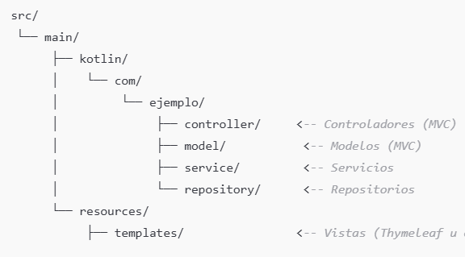 

Los pasos a seguir serían:

  * Configurar el proyecto
  * Añadir las dependencias necesarias.
  * Estructurar el proyecto en los componentes MVC.
  * Configurar el fichero de propiedades.

      
!!!tip "Enunciado de la aplicación"
    En este ejemplo vamos a crear una aplicación sencilla que muestre una lista de nombres de personas, y también permita añadir un nombre de persona nuevo. Todo mediantes **Spring MVC** y **Thymeleaf**.

**Configurar el proyecto**{.azul}
   
1) En **IntelliJ** creamos el proyecto y lo configuramos desde **File-->New-->Project**:
   
* Elige **Spring Boot**.
* Configura las siguientes opciones:
  
    * Language: **Kotlin**
    * Build System: **Maven**

* Especifica un nombre para el proyecto: **PrimerSpringMVCsencillo**
* Última versión de **JDK**
* Última versión de **Java**

2) Posteriormente seleccionamos las **dependencias** necesarias:
  
 * **Spring Web** (para el desarrollo de aplicaciones web)
 * **Thymeleaf** (motor de plantillas para la vista)
 * **Spring Boot DevTools** (opcional, para facilitar el desarrollo)

Después de aceptar, y si todo ha ido correctamente, ya tendremos nuestro proyecto creado y preparado para añadir los elementos de programación.

|   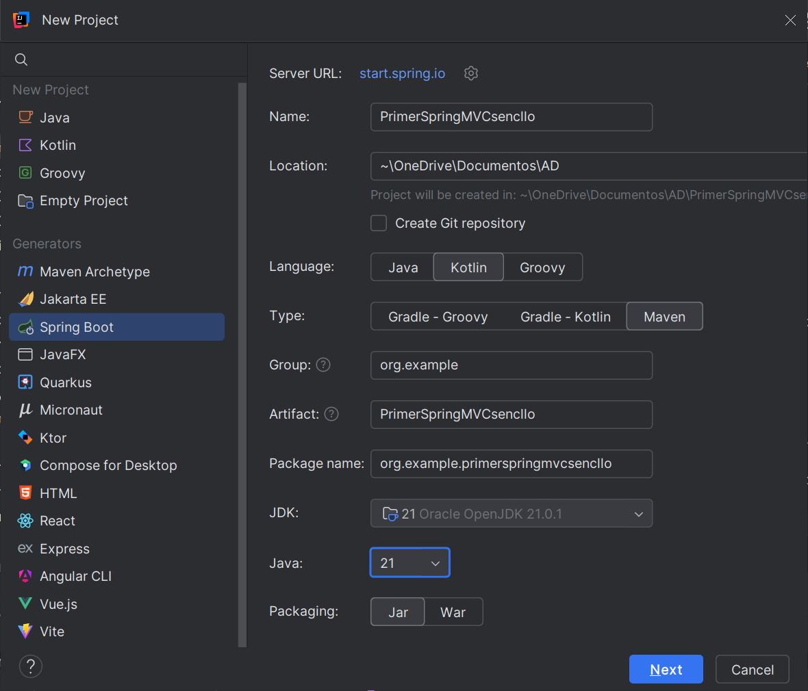  |   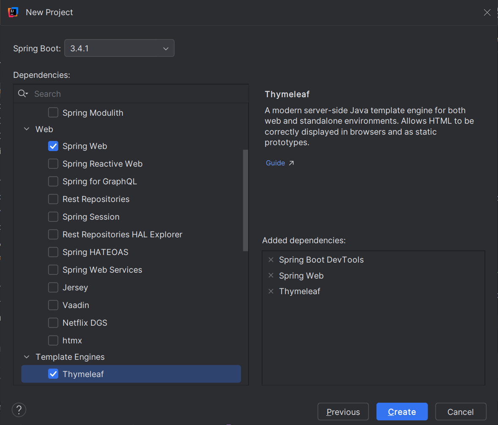    |
|---|---|

Al iniciar nuestra aplicación, lo primero que observamos es que se crea
una clase **PrimerSpringMVCsencilloApplication**  que sirve como contenedor para la configuración de la aplicación. No necesita implementar métodos adicionales, ya que Spring Boot se encarga de todo gracias a la anotación **@SpringBootApplication**.

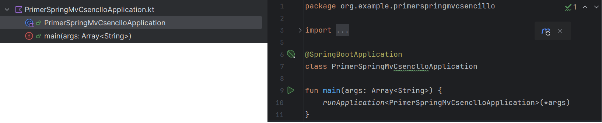

**Estructura del proyecto**{.azul}

La estructura del proyecto podría ser esta:

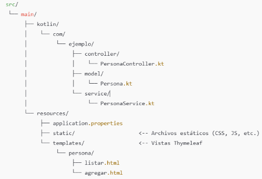 

* En la carperta **src/main/kotlin/org/example/primerspringmvcsencillo** crearemos los paquetes:
    * controller
    * model
    * service

* En la carperta **src/main/resources/template** crearemos la carpeta **persona** donde añadiremos las vistas que muestren el resultado de la aplicación.

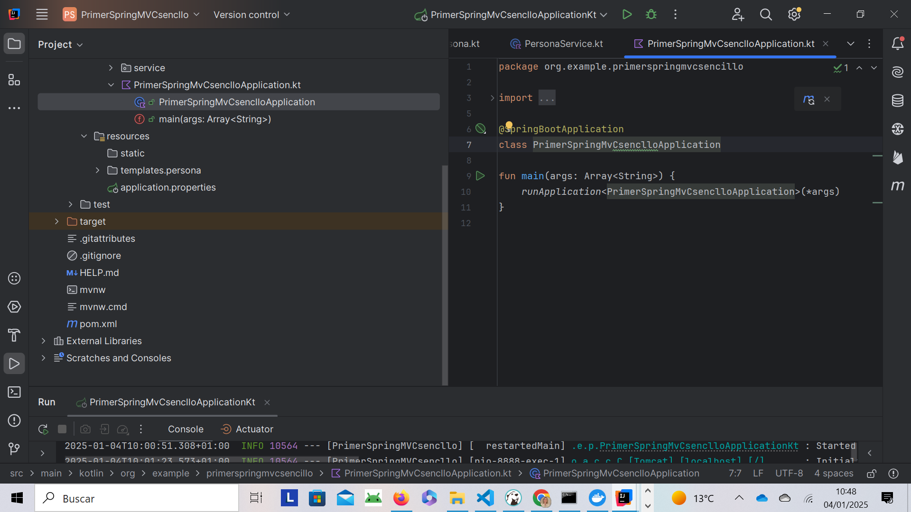 

**Implementación de la aplicación**{.azul}

Ahora ya podemos añadir la programación necesaria para nuestra aplicación siguiendo la estructura MVC creada. Dentro de cada paquete crearemos los siguientes archivos:

* **Model/Persona.kt**:

El modelo Persona es muy simple, solo tendrá un nombre.

    package com.ejemplo.model

    data class Persona(
        val id: Int,
        val nombre: String
    )

* **Service/PersonaService.kt**: 

El servicio se encargará de la lógica de negocio. En este caso, solo vamos a mantener una lista de personas en memoria.

    package com.ejemplo.service

    import org.example.primerspringmvcsencllo.model.Persona
    import org.springframework.stereotype.Service

    @Service
    class PersonaService {

        private val personas = mutableListOf(
            Persona(1, "Juan"),
            Persona(2, "Ana"),
            Persona(3, "Luis")
        )

        fun obtenerPersonas(): List<Persona> = personas

        fun agregarPersona(persona: Persona) {
            personas.add(persona)
        }
    }

* **Controller/PersonaController.kt**

 El controlador maneja las solicitudes de las vistas y realiza la interacción con el servicio.

    package com.ejemplo.controller

    import org.example.primerspringmvcsencllo.model.Persona
    import org.example.primerspringmvcsencllo.service.PersonaService
    import org.springframework.stereotype.Controller
    import org.springframework.ui.Model
    import org.springframework.web.bind.annotation.GetMapping
    import org.springframework.web.bind.annotation.PostMapping
    import org.springframework.web.bind.annotation.RequestParam

        @Controller
        class PersonaController(private val personaService: PersonaService) {

            @GetMapping("/personas")
            fun listarPersonas(model: Model): String {
                model.addAttribute("personas", personaService.obtenerPersonas())
                return "persona/listar"
            }

            @GetMapping("/personas/agregar")
            fun mostrarFormularioAgregar(): String {
                return "persona/agregar"
            }

            @PostMapping("/personas/agregar")
            fun agregarPersona(@RequestParam nombre: String): String {
                val persona = Persona(0, nombre)  // ID auto-generado
                personaService.agregarPersona(persona)
                return "redirect:/personas"
            }
        }

|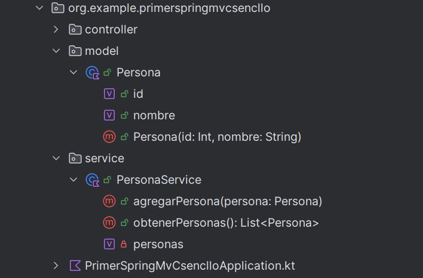|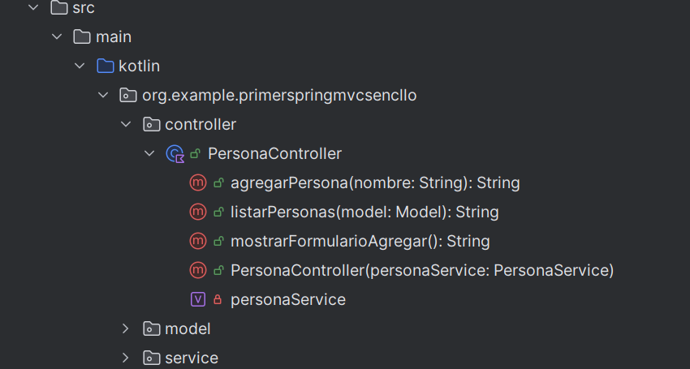
|---|---|

* **Plantillas Thymeleaf**

Para la vista utilizaremos dos plantillas Thymeleaf, una para listar los nombres de la personas y otra para agregar una persona nueva. En la carpeta **src/resources/templates/persona**, crearemos los siguienes archivos html:

a) Plantilla **listar.html**
  
    <!DOCTYPE html>
    <html xmlns:th="http://www.thymeleaf.org">
    <head>
        <title>Lista de Personas</title>
    </head>
    <body>
    <h1>Lista de Personas</h1>
    <ul>
        <li th:each="persona : ${personas}" th:text="${persona.nombre}"></li>
    </ul>
    <a href="/personas/agregar">Agregar Persona</a>
    </body>
    </html>

b) Plantilla **agregar.html**

Esta plantilla proporciona un formulario para agregar una nueva persona.

    <!DOCTYPE html>
    <html xmlns:th="http://www.thymeleaf.org">
    <head>
        <title>Agregar Persona</title>
    </head>
    <body>
        <h1>Agregar Persona</h1>
        <form action="/personas/agregar" method="post">
            <label for="nombre">Nombre:</label>
            <input type="text" id="nombre" name="nombre" required/>
            <button type="submit">Agregar</button>
        </form>
    </body>
    </html>

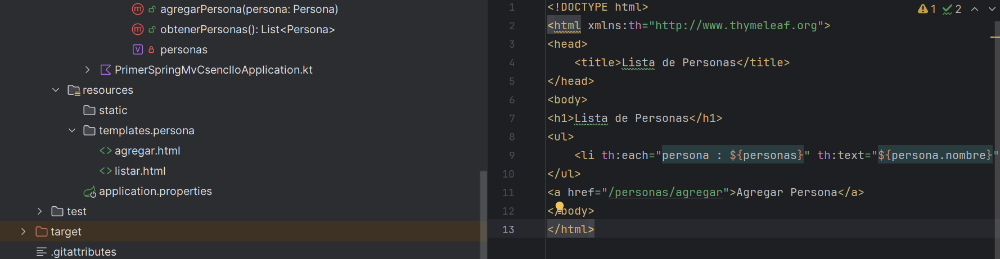     

**Configurar el Archivo application.properties**{.azul}
   
En el directorio src/main/resources, configura el archivo **application.properties** con las propiedades básicas:

    spring.thymeleaf.prefix=classpath:/templates/
    spring.thymeleaf.suffix=.html
    server.port=8080

!!!warning ""
    Recuerda que puedes cambiar el puerto si lo tienes ocupado. Puedes probar con el puerto 8888.

**Ejecutar la aplicación**{.azul}

La aplicación estará disponible en http://localhost:8080. 

Aquí podrás:

* Ver la lista de personas al acceder a **/personas**.
* Agregar una nueva persona a través del formulario en **/personas/agregar**.

| 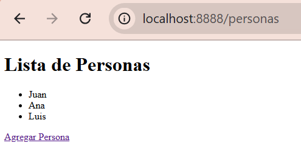|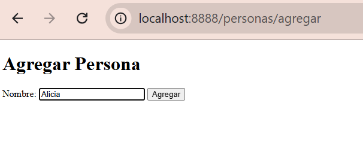|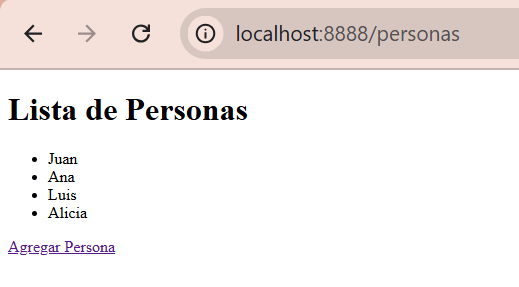|
|---|---|---|    

!!!note "Nota"
    Gracias a **Spring DevTools**, cualquier cambio que realices en el código (por ejemplo, en las plantillas o en los controladores) se reflejará automáticamente en la aplicación sin tener que reiniciarla manualmente.

