# Spring MVC

## Modelo-Vista-Controlador (MVC)

El ejemplo visto en Spring Boot es tan sencillo que no necesita un patrón de diseño especial. Para aplicaciones más complejas necesitamos de un patrón que nos permita crear aplicaciones con un código bien estructurado y más fácil de modificar, así como reutilizar sus componentes en diferentes puntos de la aplicación y que puedan evolucionar de manera independiente.

Spring MVC nos proporciona un marco estructurado, flexible y eficiente para construir aplicaciones basadas en el patrón Modelo-Vista-Controlador (MVC) que cumplan todas estas funcionalidades.

El Modelo-Vista-Controlador (MVC) es un patrón de diseño que organiza una aplicación en tres **componentes principales**:

* **Modelo**: Representa la lógica del negocio y los datos de la aplicación. Es responsable de:

    * Gestionar el estado de la aplicación.

    * Interactuar con la base de datos u otros servicios para obtener y procesar datos.

    * Proveer datos a la vista.

* **Vista**: Maneja la presentación de los datos al usuario. Es responsable de:

    * Renderizar información en un formato adecuado, como HTML.

    * Mostrar al usuario los resultados de las acciones ejecutadas.

* **Controlador**: Actúa como intermediario entre el modelo y la vista. Es responsable de:

    * Procesar las solicitudes del usuario (peticiones HTTP).

    * Interactuar con el modelo para obtener o modificar datos.

    * Seleccionar y devolver la vista adecuada para responder al usuario.

        

!!!tip "Flujo de trabajo en MVC"
    1) El usuario interactúa con la interfaz (Vista), como enviar un formulario o hacer clic en un enlace.

    2) La petición es enviada al Controlador.

    3) El Controlador procesa la petición, interactúa con el Modelo si es necesario, y selecciona la Vista que debe renderizar la respuesta.

    4) La Vista presenta la respuesta al usuario.


## MVC en Spring

Spring MVC está implementado como un servlet (el front controller)
que implementa la gestión de las peticiones del cliente web, y se
encarga de transmitirlas a un controlador adecuado. El controlador
procesa la petición y crea un modelo que contiene los datos a
devolver al usuario. Una vista se encarga de traducir el modelo a una
representación adecuada para el cliente (por ejemplo una página
HTML)


### Anotaciones comunes de Spring MVC:

A continuación se describen las anotaciones más utilizadas en cada uno de los componentes del modelo MVC en el entorno de Spring:

1) **Controlador**{.verde}
   
* **@Controller**: Define una clase como un controlador de Spring MVC. Es la principal anotación utilizada para que Spring la gestione como parte del patrón MVC.
* **@RestController**: Si el controlador está destinado a manejar solicitudes RESTful y no necesita devolver vistas, se utiliza esta anotación, que es una combinación de @Controller y @ResponseBody. Devuelve datos directamente como JSON o XML.
* **@RequestMapping**: Se usa para mapear solicitudes HTTP a métodos de un controlador. Puede configurarse para manejar diferentes tipos de solicitudes HTTP (GET, POST, etc.).
* **@GetMapping, @PostMapping, @PutMapping, @DeleteMapping**: Variantes de @RequestMapping para manejar solicitudes de tipos específicos (GET, POST, PUT, DELETE).
* **@RequestParam**: Usada para obtener parámetros de la URL (query parameters) de la solicitud HTTP.
* **@ModelAttribute**: Usada para pre-poblar un modelo con atributos antes de que se ejecute un método del controlador. Esto es útil, por ejemplo, cuando se usa en formularios.
  

2) **Modelo**{.verde}

* **@Entity**: Si estás utilizando JPA para la persistencia de datos, esta anotación define una clase como una entidad que será mapeada a una tabla de la base de datos.
* **@Table**: Usada junto con @Entity para especificar la tabla en la base de datos que corresponde a la entidad.
  
        @Entity
        @Table(name = "comarcas")
        data class Comarca(
            @Id
            @GeneratedValue(strategy = GenerationType.IDENTITY)
            val id: Int,
            val nombre: String,
            val poblacion: Int
        )

* **@Value**: Si estás utilizando Spring Expression Language (SpEL) en el modelo o en los controladores para asignar valores, puedes usar esta anotación.
  
        @Value("\${comarca.nombre}")
        var nombre: String = ""


3) **Vista**{.verde}

La vista no tiene anotaciones propias en el código fuente, sin embargo, si estás utilizando **Thymeleaf** o **JSP**,  la vista incluye elementos y sintaxis específicos que actúan como directrices para renderizar contenido dinámico.
La vista será un archivo HTML ubicado en **src/main/resources/templates**.

Las anotaciones **@RequestMapping** o **@GetMapping** en el controlador, especifican que el controlador debe devolver una vista. 

En el siguiente ejemplo, en la carpeta **src/main/resources/templates/comarca/**, puedes tener un archivo **listar.html**, que corresponde a la vista que se renderizará en el navegador. 

    @GetMapping("/comarcas")
    fun listarComarcas(model: Model): String {
        model.addAttribute("comarcas", comarcaService.obtenerComarcas())
        return "comarca/listar"  // Devuelve el nombre de la plantilla Thymeleaf
    }

**Vista con Thymeleaf**{.rojo}

* Si usas **Thymeleaf** para la vista, las anotaciones en los archivos de plantilla son prefijos para atributos de HTML. Estos prefijos permiten el manejo dinámico de datos en la vista.

<u>Ejemplo</u>

    <h1>Lista de Comarcas</h1>
    <table>
        <tr th:each="comarca : ${comarcas}">
            <td th:text="${comarca.nombre}"></td>
            <td th:text="${comarca.poblacion}"></td>
        </tr>
    </table>


A continuación, se detallan los elementos comunes de las vistas con **Thymeleaf**:

* **th:text**: Rellena el contenido de un elemento HTML con el valor dinámico.
  
        <p th:text="${mensaje}">Mensaje por defecto</p>

* **th:each**: Itera sobre una colección.

        <ul>
            <li th:each="item : ${items}" th:text="${item}"></li>
        </ul>

>>>Esto genera una lista basada en los elementos de la colección items.

* **th:if** y **th:unless**: Renderiza un contenido condicionalmente.
 
        <p th:if="${condicion}">Esto se muestra si la condición es verdadera</p>
        <p th:unless="${condicion}">Esto se muestra si la condición es falsa</p>

* **th:href** y **th:src**: Construye enlaces dinámicos para atributos como href o src.

        <a th:href="@{/ruta/{id}(id=${itemId})}">Ver detalle</a>
        

* **th:action**: Define la URL para un formulario.

        <form th:action="@{/procesar}" method="post">
            <input type="text" name="nombre">
            <button type="submit">Enviar</button>
        </form>

* **th:value** y **th:field**: Usado para rellenar valores dinámicos en campos de formulario.

        <input type="text" th:field="*{nombre}" />

**Vista sin motores de plantilla**{.rojo}

Si tu aplicación no utiliza motores de plantillas y solo devuelve datos en formatos como JSON o XML, entonces las vistas suelen ser gestionadas directamente por el controlador. En este caso:

**@RestController** en el controlador garantiza que el contenido se devuelva en el formato adecuado, sin necesidad de vistas explícitas.
El contenido es generado dinámicamente a través de bibliotecas como Jackson (para JSON).

<u>Ejemplo</u> de un controlador que devuelve JSON:

    @RestController
    class PersonaRestController {
        @GetMapping("/api/personas")
        fun listarPersonas(): List<Persona> {
            return listOf(
                Persona(1, "Juan"),
                Persona(2, "Ana")
            )
        }
    }


### Primera Aplicación Spring MVC

Al igual que se describe en el apartado de Spring Boot, podemos crear los proyectos Spring MVC de dos maneras:

* Mediante una herramienta web online (<https://start.spring.io/>) denominada **Spring Initializr**, donde por medio de unos parámetros de configuración, genera automáticamente un proyecto Maven o Gradle, según elijamos, en un archivo comprimido Zip, con la estructura de la aplicación para ser importada directamente desde un IDE. 

* Mediante un IDE, como Eclipse, IntelliJ...etc, teniendo instalados los plugins necesarios. 
  
En nuestro caso crearemos un proyecto **Maven** de Spring Boot en **IntelliJ**. La estructura general de un proyecto Spring MVC en IntelliJ sería esta:

 

Los pasos a seguir serían:

  * Configurar el proyecto
  * Añadir las dependencias necesarias.
  * Estructurar el proyecto en los componentes MVC.
  * Configurar el fichero de propiedades.


      
!!!tip "Enunciado de la aplicación"
    En este ejemplo vamos a crear una aplicación sencilla que muestre una lista de nombres de personas, y también permita añadir un nombre de persona nuevo. Todo mediantes **Spring MVC** y **Thymeleaf**.


**Configurar el proyecto**{.azul}
   
1) En **IntelliJ** creamos el proyecto y lo configuramos desde **File-->New-->Project**:
   
* Elige **Spring Boot**.
* Configura las siguientes opciones:
  
    * Language: **Kotlin**
    * Build System: **Maven**

* Especifica un nombre para el proyecto: **PrimerSpringMVCsencllo**
* Última versión de **JDK**
* Última versión de **Java**


2) Posteriormente seleccionamos las **dependencias** necesarias:
  
 * **Spring Web** (para el desarrollo de aplicaciones web)
 * **Thymeleaf** (motor de plantillas para la vista)
 * **Spring Boot DevTools** (opcional, para facilitar el desarrollo)

Después de aceptar, y si todo ha ido correctamente, ya tendremos nuestro proyecto creado y preparado para añadir los elementos de programación.

|     |       |
|---|---|

Al iniciar nuestra aplicación, lo primero que observamos es que se crea
una clase **PrimerSpringMVCsenclloApplication**  que sirve como contenedor para la configuración de la aplicación. No necesita implementar métodos adicionales, ya que Spring Boot se encarga de todo gracias a la anotación **@SpringBootApplication**.


**Estructura del proyecto**{.azul}

La estructura del proyecto podría ser esta:

 

* En la carperta **src/main/kotlin/org/example/primerspringmvcsencillo** crearemos los paquetes:
    * controller
    * model
    * service

* En la carperta **src/main/resources/template** crearemos la carpeta **persona** donde añadiremos las vistas que muestren el resultado de la aplicación.

 

**Implementación de la aplicación**{.azul}

Ahora ya podemos añadir la programación necesaria para nuestra aplicación siguiendo la estructura MVC creada. Dentro de cada paquete crearemos los siguientes archivos:

* **Model/Persona.kt**:

El modelo Persona es muy simple, solo tendrá un nombre.

    package com.ejemplo.model

    data class Persona(
        val id: Int,
        val nombre: String
    )


* **Service/PersonaService.kt**: 

El servicio se encargará de la lógica de negocio. En este caso, solo vamos a mantener una lista de personas en memoria.

    package com.ejemplo.service

    import org.example.primerspringmvcsencllo.model.Persona
    import org.springframework.stereotype.Service

    @Service
    class PersonaService {

        private val personas = mutableListOf(
            Persona(1, "Juan"),
            Persona(2, "Ana"),
            Persona(3, "Luis")
        )

        fun obtenerPersonas(): List<Persona> = personas

        fun agregarPersona(persona: Persona) {
            personas.add(persona)
        }
    }


* **Controller/PersonaController.kt**

 El controlador maneja las solicitudes de las vistas y realiza la interacción con el servicio.

    package com.ejemplo.controller

    import org.example.primerspringmvcsencllo.model.Persona
    import org.example.primerspringmvcsencllo.service.PersonaService
    import org.springframework.stereotype.Controller
    import org.springframework.ui.Model
    import org.springframework.web.bind.annotation.GetMapping
    import org.springframework.web.bind.annotation.PostMapping
    import org.springframework.web.bind.annotation.RequestParam

        @Controller
        class PersonaController(private val personaService: PersonaService) {

            @GetMapping("/personas")
            fun listarPersonas(model: Model): String {
                model.addAttribute("personas", personaService.obtenerPersonas())
                return "persona/listar"
            }

            @GetMapping("/personas/agregar")
            fun mostrarFormularioAgregar(): String {
                return "persona/agregar"
            }

            @PostMapping("/personas/agregar")
            fun agregarPersona(@RequestParam nombre: String): String {
                val persona = Persona(0, nombre)  // ID auto-generado
                personaService.agregarPersona(persona)
                return "redirect:/personas"
            }
        }

||
|---|---|


* **Plantillas Thymeleaf**

Para la vista utilizaremos dos plantillas Thymeleaf, una para listar los nombres de la personas y otra para agregar una persona nueva. En la carpeta **src/resources/templates/persona**, crearemos los siguienes archivos html:

a) Plantilla **listar.html**
  
    <!DOCTYPE html>
    <html xmlns:th="http://www.thymeleaf.org">
    <head>
        <title>Lista de Personas</title>
    </head>
    <body>
    <h1>Lista de Personas</h1>
    <ul>
        <li th:each="persona : ${personas}" th:text="${persona.nombre}"></li>
    </ul>
    <a href="/personas/agregar">Agregar Persona</a>
    </body>
    </html>

b) Plantilla **agregar.html**

Esta plantilla proporciona un formulario para agregar una nueva persona.

    <!DOCTYPE html>
    <html xmlns:th="http://www.thymeleaf.org">
    <head>
        <title>Agregar Persona</title>
    </head>
    <body>
        <h1>Agregar Persona</h1>
        <form action="/personas/agregar" method="post">
            <label for="nombre">Nombre:</label>
            <input type="text" id="nombre" name="nombre" required/>
            <button type="submit">Agregar</button>
        </form>
    </body>
    </html>

     

**Configurar el Archivo application.properties**{.azul}
   
En el directorio src/main/resources, configura el archivo **application.properties** con las propiedades básicas:

    spring.thymeleaf.prefix=classpath:/templates/
    spring.thymeleaf.suffix=.html
    server.port=8080

!!!warning ""
    Recuerda que puedes cambiar el puerto si lo tienes ocupado. Puedes probar con el puerto 8888.

**Ejecutar la aplicación**{.azul}

La aplicación estará disponible en http://localhost:8080. 

Aquí podrás:

* Ver la lista de personas al acceder a **/personas**.
* Agregar una nueva persona a través del formulario en **/personas/agregar**.


| |||
|---|---|---|    

!!!note "Nota"
    Gracias a **Spring DevTools**, cualquier cambio que realices en el código (por ejemplo, en las plantillas o en los controladores) se reflejará automáticamente en la aplicación sin tener que reiniciarla manualmente.

### Ejemplo con acceso a Bases de Datos Postgres.

En este ejemplo vamos a crear una aplicación sencilla que acceda a una base de datos Postgres. Para ello utilizaremos la base de datos **geo_ad**, que ya conocemos de temas anteriores, y que se encuentra en el servidor externo **89.36.214.106**.
La aplicación simplemente mostrará la información de la tabla **comarcas**.

Para esta aplicación crearemos un nuevo proyecto, con la misma configuración que el anterior, pero añadiremos las dependencias necesarias de acceso a la Base de Datos. 

**Configurar el proyecto**{.azul}
   
1) Creamos el proyecto y lo configuramos desde **File-->New-->Project**:
   
* Elige **Spring Boot**.
* Configura las siguientes opciones:
  
    * Language: **Kotlin**
    * Build System: **Maven**

* Especifica un nombre para el proyecto: **PrimerSpringMVC**
* Última versión de **JDK**
* Última versión de **Java**


2) Posteriormente seleccionamos las dependencias necesarias:
  
!!!note nota
    Como la aplicación accede a una Base de datos, necesitaremos las dependencias adicionales **Spring Data JPA** y **PostgreSQL Driver**.
    
    * **Spring Web** (para el desarrollo de aplicaciones web)
    * **Thymeleaf** (motor de plantillas para la vista)
    * **Spring Boot DevTools** (opcional, para facilitar el desarrollo)
    * **Spring Data JPA** (facilita la integración de aplicaciones Spring con bases de datos relacionales utilizando el marco JPA (Java Persistence API))
    * **PostgresSQL Driver** (proporciona el controlador JDBC para conectarse a bases de datos PostgreSQL.)

Después de aceptar, y si todo ha ido correctamente, ya tendremos nuestro proyecto creado y preparado para añadir los elementos de programación.

|   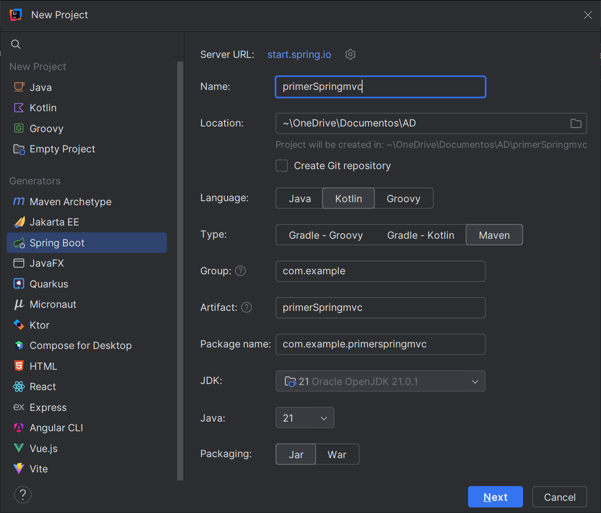  |   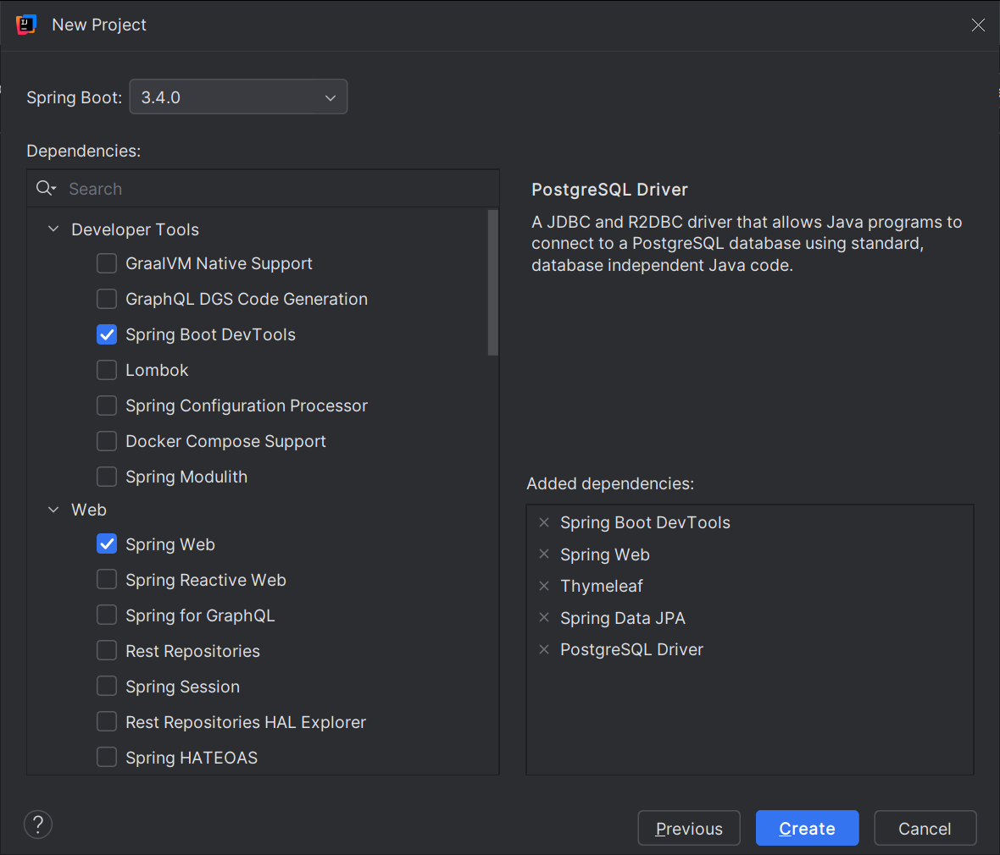    |
|---|---|

Al iniciar nuestra aplicación, lo primero que observamos es que se crea
una clase **PrimerSpringMVCApplication**  que sirve como contenedor para la configuración de la aplicación. No necesita implementar métodos adicionales, ya que Spring Boot se encarga de todo gracias a la anotación **@SpringBootApplication**.

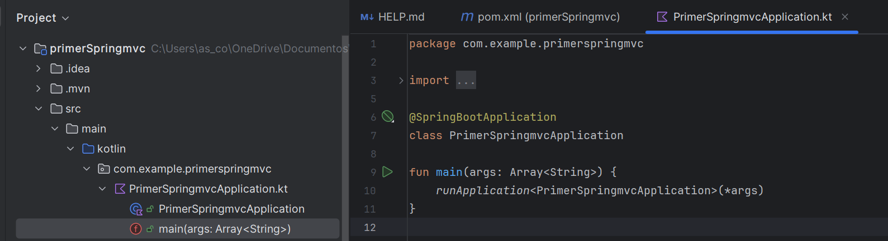

**Crear la estructura del Proyecto**{.azul}

La estructura básica del proyecto debe reflejar el patrón MVC. Organiza las carpetas de la siguiente forma:
   
   * **Controladores**: src/main/kotlin/org/tuapp/controller
   * **Vistas**: src/main/resources/templates
   * **Recursos estáticos**: src/main/resources/static
   * **Datos**: src/main/kotlin/org/tuapp/model
   * **Repositorio**: src/main/kotlin/org/tuapp/repository

Para ello crea los paquetes: **controller**, **model** y **repository** dentro de la carpeta **src/main/kotlin/org/tuapp**.


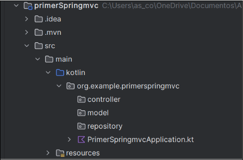

**Implementación de la aplicación**{.azul}

Ahora ya podemos añadir la programación necesaria para nuestra aplicación siguiendo la estructura MVC creada. Dentro de cada paquete crearemos los siguientes archivos:

* **Entidad JPA**

Define las entidades que corresponden a las tablas existentes en la base de datos. No necesitas configuraciones especiales más allá de mapear las columnas.
En nuestro caso definimos la entidad comarca y sus campos.

En el paquete **model** crea un archivo llamado **comarca.kt**

    import jakarta.persistence.*

    @Entity /*Define una clase como una entidad JPA, lo que significa que estará mapeada a una tabla en la base de datos.*/
    @Table(name = "comarca")
    data class comarca(
        @Id /*dentifica el campo como la clave primaria de la entidad.*/
        val nom_c: String = "",
        val provincia: String = ""
    )

    
* **Repositorio**

Crea un repositorio que permita ejecutar consultas sobre la tabla correspondiente.

Dentro del paquete **repository**, crea un archivo llamado **ComarcaRepository.kt**

    import org.example.primerspringmvc.model.comarca
    import org.springframework.data.jpa.repository.JpaRepository
    import org.springframework.stereotype.Repository

    @Repository
    interface ComarcaRepository : JpaRepository<comarca, String> {
    fun findByProvincia(provincia: String): List<comarca>
    } 

* **Controlador**

El controlador manejará las solicitudes GET para obtener información de la base de datos.

Dentro del paquete **controller**, crea un archivo llamado **ComarcaController.kt**

    import org.example.primerspringmvc.model.comarca
    import org.example.primerspringmvc.repository.ComarcaRepository
    import org.springframework.web.bind.annotation.*

    @RestController
    @RequestMapping("/comarcas")
    class ComarcaController(private val comarcaRepository: ComarcaRepository) {

        // Endpoint para obtener todas las comarcas
        @GetMapping
        fun obtenerComarcas(): List<comarca> = comarcaRepository.findAll()
    }    
!!!note ""
    * **@RestController:** Combina **@Controller** y **@ResponseBody**.
    Devuelve directamente datos en formato JSON en lugar de buscar vistas como Thymeleaf.

    * **ObtenerComarcas()**: Devuelve una lista de objetos comarca.
    Spring automáticamente convierte esta lista a JSON usando Jackson (que viene incluido con Spring Boot).

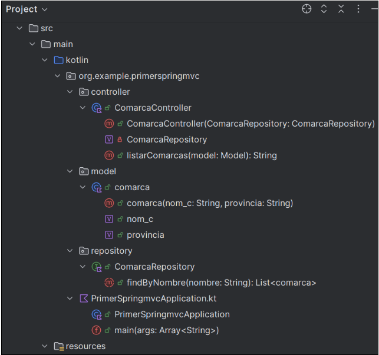

* **Vistas**

Las vistas pueden ser representadas por tecnologías como JSP, Thymeleaf, o JSON (en caso de APIs).

En este ejemplo vamos a visualizar los datos en un navegador con formato **JSON** y más adelante lo haremos mediante **Thymeleaf** para ver ambos casos. 

**Configurar la conexión al Servidor Postgres:**{.azul}

 En el archivo **src/main/resources/application.properties**  configura la conexión a tu base de datos existente:

    spring.datasource.url=jdbc:postgresql://<HOST>:<PUERTO>/<DB_NAME>
    spring.datasource.username=<USUARIO>
    spring.datasource.password=<CONTRASEÑA>
    spring.jpa.hibernate.ddl-auto=update

Cambiaremos los datos de conexión al servidor externo:

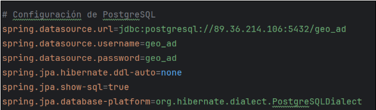

!!!warning ""
    Recuerda que puedes cambiar el puerto si lo tienes ocupado. Puedes probar con el puerto 8888.

**Ejecutar la aplicación**{.azul}

La aplicación estará disponible en http://localhost:8080, o el puerto que hayas especificado, para listar las comarcas.
  
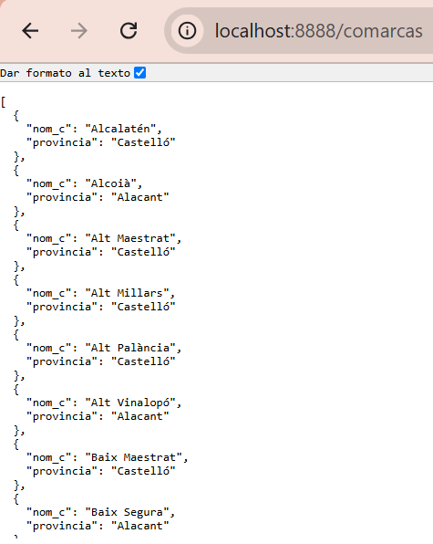

!!!warning "" 
    Sería deseable que el resultado se mostrara de manera más amigable para el usuario, por lo que en el siguiente ejemplo haremos los cambios necesarios para utilizar **Thymeleaf** y que el resultado se muetre en cajas de texto.
   

**Thymeleaf para mostrar los resultados:**{.verde}

1) **Configuración de dependencias**. Asegúrate de tener la dependencia de Thymeleaf en tu archivo pom.xml. Esta dependencia la hemos seleccionado al configurar la aplicación y seguramente ya la tengamos incluida.

    <dependency>
        <groupId>org.springframework.boot</groupId>
        <artifactId>spring-boot-starter-thymeleaf</artifactId>
    </dependency>


2) Configurar Thymeleaf en **application.properties**

Añade las siguientes propiedades:
   
    spring.thymeleaf.prefix=classpath:/templates/
    spring.thymeleaf.suffix=.html
    spring.thymeleaf.cache=false  

3) **Modificar el Controlador con datos del repositorio**. El controlador debe recuperar los datos desde el repositorio y pasarlos a la vista usando un modelo. Cambia la implementación del controlador:

    import org.springframework.stereotype.Controller
    import org.example.primerspringmvc.repository.ComarcaRepository
    import org.springframework.ui.Model
    import org.springframework.web.bind.annotation.*

    @Controller
    @RequestMapping("/comarcas")
    class ComarcaController(private val ComarcaRepository: ComarcaRepository) {
        @GetMapping
        fun listarComarcas(model:Model): String {
            val comarcas = ComarcaRepository.findAll()
            model.addAttribute("comarcas", comarcas)
            return "comarcas" // Nombre de la plantilla HTML
        }
    }
      

4) **Vistas**
   
Para agregar un entorno de usuario amigable con cajas de texto y que los datos de la base de datos se muestren en una aplicación web, crea un archivo **comarcas.html** en el directorio **src/main/resources/templates**. 

<!DOCTYPE html>
    <html xmlns:th="http://www.thymeleaf.org">
    <head>
        <title>Lista de Comarcas</title>
    </head>
    <body>
    <h1>Lista de Comarcas</h1>
    <table border="1">
        <tr>
            <th>ID</th>
            <th>Provincia</th>
            
        </tr>
        <tr th:each="comarca : ${comarcas}">
            <td th:text="${comarca.nom_c}">ID</td>
            <td th:text="${comarca.provincia}">Provincia</td>
        </tr>
    </table>
    </body>
    </html>
   
!!!note ""
      * **th:each**: Itera sobre la lista de comarcas.
      * **th:text**: Inserta dinámicamente el valor de un campo en el HTML.     


**Ejecuatar la aplicación**{.azul}

* Accede a http://localhost:8888/comarcas  para listar las comarcas.
 

En el navegador, se mostrará una tabla HTML con las comrcas almacenadas en la base de datos. Los datos dinámicos se renderizan usando **Thymeleaf**. Este enfoque permite crear interfaces web amigables y bien estructuradas.
 

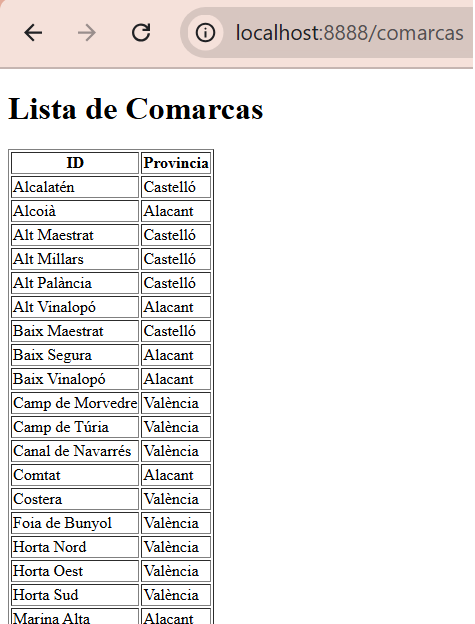


**Ejemplo de consulta a la Base de datos**{.verde}

Con la anotación **@Query** en el repositorio, podemos realizar consultas personalizadas a la base de datos. 
        
A continuación veremos los cambios que deberíamos hacer en los ficheros para poder hacer una consulta con parámetros y visualizar los datos tanto en json com con thymeleaf:

!!!tip "Cambios en los ficheros .kt:"
    **ComarcaRepository**

        import org.springframework.data.jpa.repository.Query
        import org.springframework.data.repository.query.Param
        import org.example.primerspringmvc.model.comarca
        import org.springframework.data.jpa.repository.JpaRepository
        import org.springframework.stereotype.Repository

        @Repository
        interface ComarcaRepository : JpaRepository<comarca, Long> {
            @Query("SELECT c FROM comarca c WHERE c.provincia = :provincia")
            fun findComarcasporProvincia(@Param("provincia") provincia: String): List<comarca>
        }

    **ComarcaController**

        import org.example.primerspringmvc.model.comarca
        import org.springframework.stereotype.Controller
        import org.example.primerspringmvc.repository.ComarcaRepository
        import org.springframework.ui.Model
        import org.springframework.web.bind.annotation.*

        @RestController //en lugar de @Controller
        @RequestMapping("/comarcas")
        class ComarcaController(private val ComarcaRepository: ComarcaRepository) {
            @GetMapping("/buscar")
            fun buscarComarcasPorProvincia(@RequestParam provincia: String): List<comarca> {
                return ComarcaRepository.findComarcasporProvincia(provincia)
            }
        }

--------------
**<u>Anotaciones importantes</u>**

**@Query**: Permite definir consultas SQL personalizadas directamente en el repositorio.
La consulta SELECT c FROM Comarca c WHERE c.provincia = :provincia selecciona todas las comarcas donde la columna provincia coincide con el parámetro provincia.

**@Param**: Vincula el parámetro de la consulta con el valor que se pasa desde el método.
En este caso, @Param("provincia") conecta el parámetro provincia de la consulta SQL con el argumento del método.

**@GetMapping** y **@RequestParam**: Define un endpoint HTTP GET en el controlador.
El parámetro provincia se obtiene de la URL. Por ejemplo, si queremos listar las comarcas de la provincia de Alacant, obtenemos:

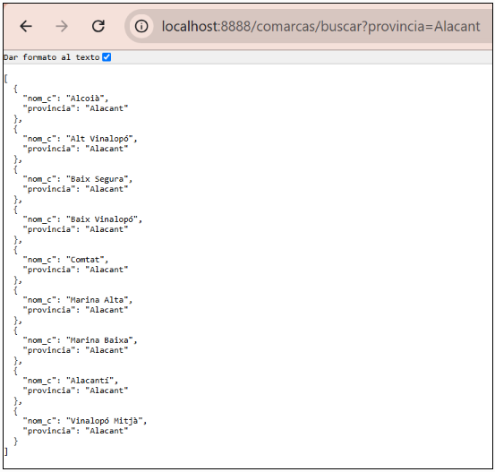 

**<u>Visualizar la salida con Thymeleaf</u>**

Si la visualización la queremos hacer con Thymeleaf los cambios a realizar se harían solo en  **ComarcasController**, ya que el formulaio comarcas.html se puede seguir utilizando si queremos mostrar los mismos campos:

    import org.springframework.stereotype.Controller
    import org.example.primerspringmvc.repository.ComarcaRepository
    import org.springframework.ui.Model
    import org.springframework.web.bind.annotation.*

    @Controller     //en lugar de @RestController
    @RequestMapping("/comarcas")
    class ComarcaController(private val ComarcaRepository: ComarcaRepository) {
        @GetMapping
        fun listarComarcas(model:Model): String {
            val comarcas = ComarcaRepository.findAll()
            model.addAttribute("comarcas", comarcas)
            return "comarcas" // Nombre de la plantilla HTML
        }

        @GetMapping("/buscar")
        fun buscarComarcasPorProvincia(@RequestParam provincia: String, model: Model): String {
            val comarcas= ComarcaRepository.findComarcasporProvincia(provincia)
            model.addAttribute("comarcas", comarcas)
            return "comarcas" // Nombre de la plantilla HTML
        }
    }

Y el resultado se vería así:

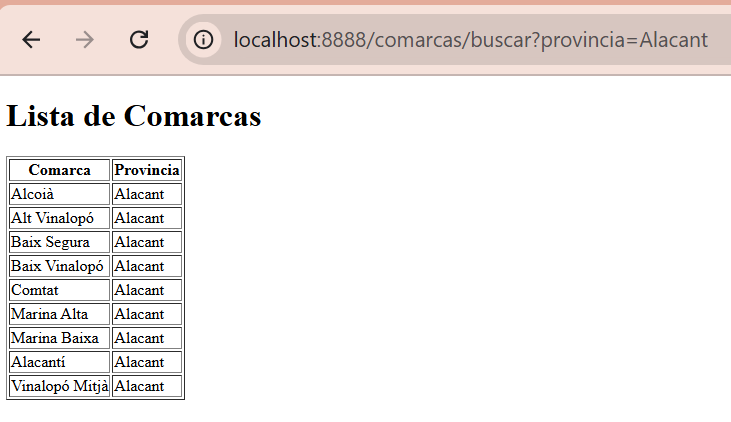 

----------

#### **Base de datos en contenedor Docker**{.verde}

Para no tener que instalarnos un servidor Postgres en nuestro equipo, podemos tener nuestra base de datos en un contenedor Docker.

En este caso, los cambios principales se centran en la configuración de conexión en la aplicación y en el despliegue del contenedor de PostgreSQL. 

Antes de acceder al contenedor tenemos que crearlo. En nuestro caso crearemos un contenedor Docker de Postgres y posteriormente restauraremos la base de datos **geo_ad** en dicho contenedor, para poder disponer de la misma configuracion y los mismos datos que en el servidor externo. 

Partimos del hecho que tenemos instalado Docker en nuesto equipo, en caso contario te dejo un pequeño tutorial de como instalarlo en el apartado **Docker** de esta unidad. Los pasos a seguir para crear dicho contendor son:

1) **Ejecutar PostgreSQL en Docker**

* Crea y ejecuta el contenedor de PostgreSQL:

```bash
docker run --name postgres-container -e POSTGRES_USER=admin -e POSTGRES_PASSWORD=admin -e POSTGRES_DB=demo -p 5432:5432 -d postgres
```
!!!note ""
    * POSTGRES_USER: Usuario de la base de datos.
    * POSTGRES_PASSWORD: Contraseña del usuario.
    * POSTGRES_DB: Nombre de la base de datos.
    * -p 5432:5432: Mapea el puerto 5432 del contenedor al puerto 5432 de tu máquina.

* Verifica que el contenedor esté corriendo:

```bash
docker ps
```

* (Opcional) Conéctate al contenedor para verificar la base de datos, desde **DBeaver**, o desde el terminal:

```bash
docker exec -it postgres-container psql -U admin -d demo
```

1) **Restaurar la base de datos en el contenedor con DBeaver**:

Vamos a restaurar la base de datos **geo_ad** en la base de datos **demo**, que hemos creado con docker. Para ello os he dejado un archivo **dump**, en el apartado **recursos de Aules**, que contiene el backup de geo_ad. Lo siguiente será restaurar este backup en **demo**, siguiendo esto pasos:

!!!note ""
      * Crear una **nueva conexión** en DBeaver al contenedor local:
          
          * Host: localhost
          * Puerto: 5432
          * Usuario y contraseña: admin
          * Base de datos: demo
       
      * **Restaurar** el archivo de respaldo: Haz clic derecho en la base de datos en el contenedor → Herramientas > Restaurar (Restore).

        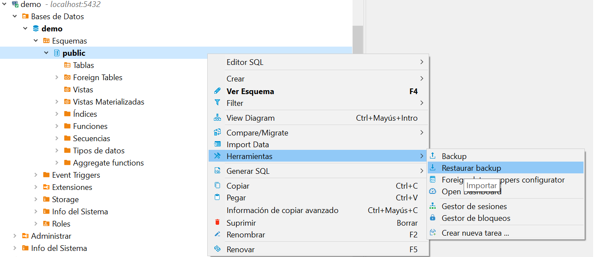 

       * **Archivo de respaldo**: Selecciona el archivo de respaldo exportado, disponible en el aula virtual en la carpeta de recursos del tema.

        Pulsa Start y espera a que termine la restauración. Una vez terminado selecciona cancelar para que no vuelva a realizar la restauración.

        |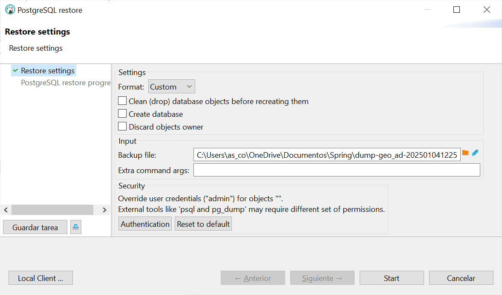 |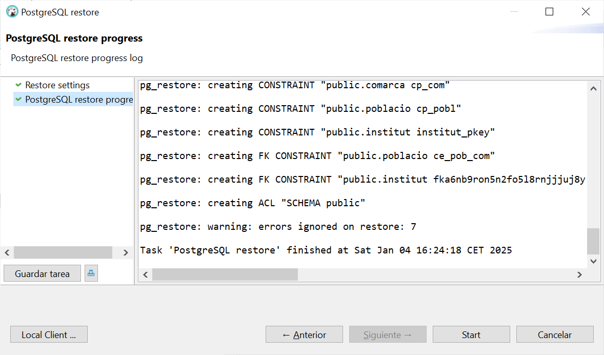 |
        |---|---|
            

3) **Cambios en la Configuración de la Aplicación**

En el archivo **application.properties**, configura la conexión a PostgreSQL en el contenedor Docker. Asegúrate de usar la IP del contenedor o localhost si estás ejecutando la aplicación desde la misma máquina.

* Opción 1: Usar localhost (si el contenedor está corriendo en tu máquina)


        spring.datasource.url=jdbc:postgresql://localhost:5432/demo
        spring.datasource.username=admin
        spring.datasource.password=admin
        spring.jpa.hibernate.ddl-auto=none
        spring.jpa.show-sql=true
        spring.jpa.properties.hibernate.format_sql=true


* Opción 2: Utilizar la IP del contenedor (si la aplicación está en otro contenedor)

>>* Para encontrar la IP del contenedor PostgreSQL:
    
        docker inspect postgres-container | grep IPAddress
    
>>* Utiliza la IP encontrada para configurar la conexión:


        spring.datasource.url=jdbc:postgresql://<IP_DEL_CONTENEDOR>:5432/demo
        spring.datasource.username=admin
        spring.datasource.password=admin
        spring.jpa.hibernate.ddl-auto=none
        spring.jpa.show-sql=true
        spring.jpa.properties.hibernate.format_sql=true

!!!warning ""
    Todos los cambios que necesitas para ejecutar la aplicación y que acceda a la base de datos que se encuentra en el contenedor son los anteriormente descritos. El resto de ficheros y estructura no se verá afectada.

!!!tip ""
    Una vez tenemos la base de datos restaurada con los datos de **geo_ad** ya podemos ejecutar la aplicación y comprobar que los resultados son los mismos que si accedemos a la base de datos del servidor.

#### **Operaciones CRUD sobre base de datos en contenedor Docker**{.verde}

Siguiendo con el ejemplo visto en Spring MVC, de acceder a una base de datos relacional Postgres en un contenedor Docker, en este apartado iremos más allá y veremos como realizar operaciones CRUD, ya que ahora la base de datos está en local y podemos hacer todas las modificaciones que necesitemos.
Como ejemplo, haremos modificaciones sobre la tabla **comarcas**.

El único fichero a modificar será el **controlador (ComarcaController.kt)** y la creación de nuevas **vistas** para visualizar los resultados:

1) **Create**

* **Controlador**

        @Controller
        @RequestMapping("/comarcas")
        class ComarcaController(private val comarcaRepository: ComarcaRepository) {

            @GetMapping("/nueva")
            fun mostrarFormularioNuevaComarca(model: Model): String {
                model.addAttribute("comarca", comarca())
                return "nueva-comarca"
            }

            @PostMapping("/nueva")
            fun guardarComarca(@ModelAttribute comarca: comarca): String {
                comarcaRepository.save(comarca)
                return "redirect:/comarcas"
            }
        }

* **Vista (nueva-comarca.html)**

        <!DOCTYPE html>
        <html xmlns:th="http://www.thymeleaf.org">

        <head>
            <title>Nueva Comarca</title>
        </head>
        <body>
            <h1>Nueva Comarca</h1>
            <form th:action="@{/comarcas/nueva}" th:object="${comarca}" method="post">
                <label for="nom_c">Nombre:</label>
                <input type="text" id="nom_c" name="nom_c" th:value="*{nom_c}" required><br>
                
                <label for="provincia">Provincia:</label>
                <input type="text" id="provincia" name="provincia" th:value="*{provincia}" required><br>
                
                <button type="submit">Guardar</button>
            </form>
        </body>
        </html>

2) **Read**

* **Controlador**: Ya implementado en el ejercicio anterior.

    @GetMapping
    fun listarComarcas(model: Model): String {
        val comarcas = comarcaRepository.findAll()
        model.addAttribute("comarcas", comarcas)
        return "comarcas"
    }

* **Vista (comarcas.html)**: Ya creada en el ejercicio anterior.

3) **Update**

* **Controlador**
  
        @GetMapping("/editar/{id}")
        fun mostrarFormularioEditarComarca(@PathVariable id: String, model: Model): String {
            val comarca = comarcaRepository.findById(id).orElseThrow { IllegalArgumentException("Comarca no encontrada: $id") }
            model.addAttribute("comarca", comarca)
            return "editar-comarca"
        }

        @PostMapping("/editar/{id}")
        fun actualizarComarca(@PathVariable id: String, @ModelAttribute comarca: comarca): String {
            if (!comarcaRepository.existsById(id)) {
                throw IllegalArgumentException("Comarca no encontrada: $id")
            }
            comarcaRepository.save(comarca)
            return "redirect:/comarcas"
        }

* **Vista (editar-comarca.html)**

        <!DOCTYPE html>
        <html xmlns:th="http://www.thymeleaf.org">

        <head>
            <title>Editar Comarca</title>
        </head>
        <body>
            <h1>Editar Comarca</h1>
            <form th:action="@{/comarcas/editar/{id}(id=${comarca.nom_c})}" th:object="${comarca}" method="post">
                <label for="nom_c">Nombre:</label>
                <input type="text" id="nom_c" name="nom_c" th:value="*{nom_c}" readonly><br>
                
                <label for="provincia">Provincia:</label>
                <input type="text" id="provincia" name="provincia" th:value="*{provincia}" required><br>
                
                <button type="submit">Actualizar</button>
            </form>
        </body>
        </html>

4) **Delete**

* **Controlador**

        @GetMapping("/eliminar/{id}")
        fun eliminarComarca(@PathVariable id: String): String {
            if (!comarcaRepository.existsById(id)) {
                throw IllegalArgumentException("Comarca no encontrada: $id")
            }
            comarcaRepository.deleteById(id)
            return "redirect:/comarcas"
        }

* **Vista**  (Modificar comarcas.html para agregar la opción de eliminar)

        <tr th:each="comarca : ${comarcas}">
            <td th:text="${comarca.nom_c}">ID</td>
            <td th:text="${comarca.provincia}">Provincia</td>
            <td>
                <a th:href="@{/comarcas/editar/{id}(id=${comarca.nom_c})}">Editar</a>
                <a th:href="@{/comarcas/eliminar/{id}(id=${comarca.nom_c})}" onclick="return confirm('¿Estás seguro?')">Eliminar</a>
            </td>
        </tr>


    ---

